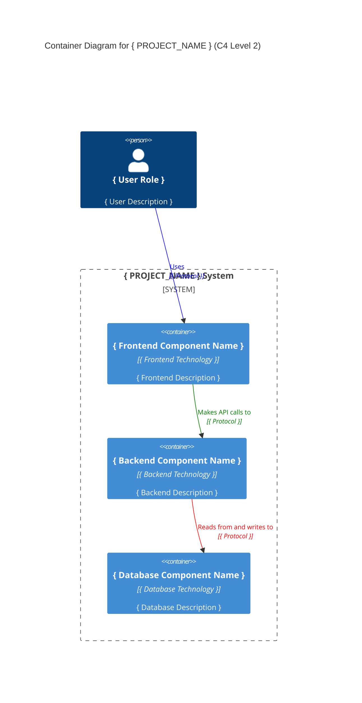

# Systems Architecture for { PROJECT_NAME }

## Overview

**{ Project name }** follows a { architecture_style } architecture, designed for { primary_characteristics } with { technology_approach }.

## System Components

### { S1 } { Component 1 Name }

**Purpose:** { Brief description of component responsibility }

**Technology Stack:**

- **Language**: { type_script | java | c-sharp }
- **Framework**: { angular | express | spring | .net }
- **Key Libraries**: { library1 }, { library2 }

**Responsibilities:**

- { responsibility1 }
- { responsibility2 }

## Data Layer

### Database Design

**Database Type:** { relational | NoSQL | etc. }
**Technology:** { postgresql | mongodb | etc. }

**Data Access Patterns:**

- { pattern1 }: { description }
- { pattern2 }: { description }

**Key Design Decisions:**

- { decision1 }
- { decision2 }

## Integration Patterns

### { I1 } { Integration Pattern 1 }

**Type:** { REST API | GraphQL | Message Queue | etc. }
**Purpose:** { What this integration accomplishes }
**Protocol:** { HTTP | WebSocket | etc. }
**Data Format:** { JSON | XML | etc. }

## Security Architecture

### Authentication & Authorization

**Authentication Method:** { auth_method }
**Session Management:** { session_approach }
**Authorization Pattern:** { authorization_pattern }

## System Architecture Diagram

## Additional Information

<!-- Add any additional technical information -->

- [Git repository]({ GIT_REPO_URL })
- [PRD Document](./PRD.md)
- [DOMAIN Models](./DOMAIN.md)
- [BACKLOG of features](./BACKLOG.md)

> End of SYSTEMS for { PROJECT_NAME }, last updated on { DATE }.
