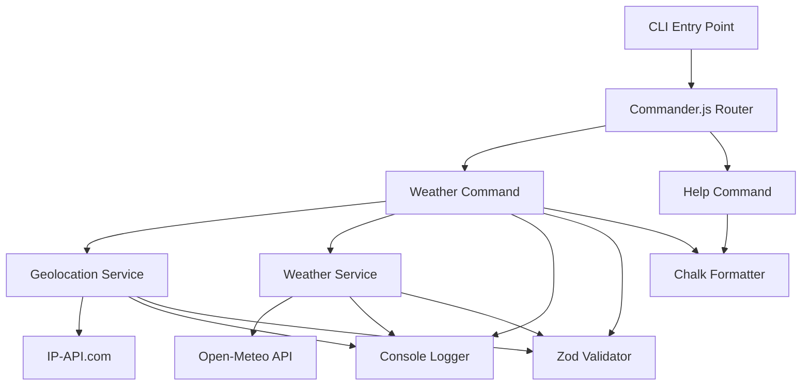

# Design Document

## Overview

The Node CLI Archetype is a TypeScript-based template project that provides a structured foundation for building command-line interfaces using modern Node.js V24 features. The design emphasizes simplicity, modern best practices, and educational value while avoiding deprecated dependencies.

The archetype follows a modular architecture with clear separation between core infrastructure, business logic, and configuration. It serves as both a functional CLI application and a learning resource for developers.

## Architecture

### High-Level Architecture



### Project Structure

```
archetype-node-cli/
├── src/
│   ├── commands/
│   │   ├── weather.command.ts
│   │   └── help.command.ts
│   ├── services/
│   │   ├── geolocation.service.ts
│   │   └── weather.service.ts
│   ├── types/
│   │   ├── geolocation.types.ts
│   │   └── weather.types.ts
│   ├── utils/
│   │   ├── logger.util.ts
│   │   └── validator.util.ts
│   └── main.ts
├── tests/
│   ├── unit/
│   │   ├── services/
│   │   └── commands/
│   └── e2e/
│       └── cli.test.ts
├── docs/
├── .env.example
├── package.json
├── tsconfig.json
├── eslint.config.js
├── .prettierrc
└── README.md
```

## Components and Interfaces

### CLI Entry Point (main.ts)

The main entry point initializes the Commander.js program and registers all available commands. It handles global error catching and environment setup.

**Key Responsibilities:**
- Initialize Commander.js program
- Register command handlers
- Load environment variables using Node.js built-in support
- Global error handling
- Version and description setup

### Command Layer

#### Weather Command
Implements the weather functionality by coordinating between geolocation and weather services.

**Interface:**
```typescript
interface WeatherCommand {
  execute(): Promise<void>;
  displayWeatherInfo(weather: WeatherData, location: LocationData): void;
}
```

#### Help Command
Provides comprehensive help information and usage examples.

**Interface:**
```typescript
interface HelpCommand {
  execute(): void;
  displayUsage(): void;
  displayExamples(): void;
}
```

### Service Layer

#### Geolocation Service
Handles IP-based geolocation using the IP-API service.

**Interface:**
```typescript
interface GeolocationService {
  getCurrentLocation(): Promise<LocationData>;
  validateLocationResponse(response: unknown): LocationData;
}
```

#### Weather Service
Fetches weather data from Open-Meteo API based on coordinates.

**Interface:**
```typescript
interface WeatherService {
  getWeatherByCoordinates(lat: number, lon: number): Promise<WeatherData>;
  validateWeatherResponse(response: unknown): WeatherData;
}
```

### Utility Layer

#### Logger Utility
Provides structured logging using console with different log levels and colored output.

**Interface:**
```typescript
interface Logger {
  info(message: string, ...args: any[]): void;
  warn(message: string, ...args: any[]): void;
  error(message: string, ...args: any[]): void;
  debug(message: string, ...args: any[]): void;
}
```

#### Validator Utility
Centralizes Zod schema validation logic.

**Interface:**
```typescript
interface Validator {
  validateGeolocationResponse(data: unknown): LocationData;
  validateWeatherResponse(data: unknown): WeatherData;
}
```

## Data Models

### Location Data Model
```typescript
interface LocationData {
  lat: number;
  lon: number;
  city: string;
  country: string;
  region: string;
  timezone: string;
}
```

### Weather Data Model
```typescript
interface WeatherData {
  temperature: number;
  humidity: number;
  windSpeed: number;
  description: string;
  timestamp: string;
  units: {
    temperature: string;
    windSpeed: string;
  };
}
```

### API Response Models
Zod schemas for validating external API responses:

```typescript
// IP-API Response Schema
const LocationResponseSchema = z.object({
  lat: z.number(),
  lon: z.number(),
  city: z.string(),
  country: z.string(),
  regionName: z.string(),
  timezone: z.string(),
  status: z.literal('success')
});

// Open-Meteo Response Schema
const WeatherResponseSchema = z.object({
  current_weather: z.object({
    temperature: z.number(),
    windspeed: z.number(),
    weathercode: z.number(),
    time: z.string()
  }),
  hourly_units: z.object({
    temperature_2m: z.string(),
    windspeed_10m: z.string()
  })
});
```

## Error Handling

### Error Types
- **NetworkError**: For API communication failures
- **ValidationError**: For data validation failures
- **ConfigurationError**: For missing environment variables or configuration issues

### Error Handling Strategy
1. **Service Level**: Catch and wrap API errors with context
2. **Command Level**: Handle service errors and provide user-friendly messages
3. **Global Level**: Catch unhandled errors and provide graceful exit

### Error Display
Use Chalk to display errors with appropriate colors:
- Red for critical errors
- Yellow for warnings
- Blue for informational messages

## Testing Strategy

### Unit Testing
- **Framework**: Node.js built-in test runner (`node:test`)
- **Assertions**: Node.js built-in assertions (`node:assert/strict`)
- **Coverage**: All services, utilities, and command logic
- **Mocking**: Mock external API calls using built-in test utilities

### End-to-End Testing
- Test complete CLI workflows
- Verify command parsing and execution
- Test error scenarios and edge cases
- Validate output formatting and colors

### Test Structure
```
tests/
├── unit/
│   ├── services/
│   │   ├── geolocation.service.test.ts
│   │   └── weather.service.test.ts
│   ├── commands/
│   │   ├── weather.command.test.ts
│   │   └── help.command.test.ts
│   └── utils/
│       ├── logger.util.test.ts
│       └── validator.util.test.ts
└── e2e/
    └── cli.test.ts
```

### Development Workflow
- **File Watching**: Use `node --watch` for automatic test re-running
- **TypeScript Execution**: Run tests directly with `node --disable-warning=ExperimentalWarning`
- **Continuous Integration**: Tests run on every commit

## Configuration Management

### TypeScript Configuration (tsconfig.json)
- Target ES2022 for Node.js V24 compatibility
- Strict type checking enabled
- Module resolution for Node.js
- Source maps for debugging

### ESLint Configuration (eslint.config.js)
- TypeScript-specific rules
- Node.js environment settings
- Import/export validation
- Code style enforcement

### Prettier Configuration (.prettierrc)
- Consistent code formatting
- Integration with ESLint
- TypeScript-aware formatting

### Package.json Scripts
```json
{
  "scripts": {
    "start": "node --disable-warning=ExperimentalWarning --env-file=.env src/main.ts",
    "dev": "node --watch --disable-warning=ExperimentalWarning --env-file=.env src/main.ts",
    "test": "node --test tests/**/*.test.ts",
    "test:watch": "node --watch --test tests/**/*.test.ts",
    "lint": "eslint src tests",
    "format": "prettier --write src tests",
    "type-check": "tsc --noEmit"
  }
}
```

## External API Integration

### IP Geolocation API (ip-api.com)
- **Endpoint**: `http://ip-api.com/json/`
- **Rate Limiting**: 45 requests per minute for free tier
- **Response Format**: JSON with location data
- **Error Handling**: Validate response status and required fields

### Open-Meteo API
- **Endpoint**: `https://api.open-meteo.com/v1/forecast`
- **Parameters**: latitude, longitude, current_weather=true
- **Rate Limiting**: No rate limits for non-commercial use
- **Response Format**: JSON with weather data
- **Error Handling**: Validate response structure and weather codes

## Security Considerations

### Environment Variables
- Use `.env` files for configuration
- Include `.env.example` with dummy values
- Add `.env` to `.gitignore`
- Load using Node.js built-in `--env-file` flag

### API Security
- No API keys required for chosen services
- Implement request timeouts
- Validate all external data with Zod schemas
- Handle rate limiting gracefully

### Input Validation
- Validate all user inputs
- Sanitize command-line arguments
- Use TypeScript for compile-time type safety
- Runtime validation with Zod schemas

## Performance Considerations

### Startup Time
- Minimize dependencies
- Lazy load heavy modules
- Use dynamic imports where appropriate

### Memory Usage
- Stream large responses when possible
- Clean up resources after use
- Avoid memory leaks in long-running processes

### Network Efficiency
- Implement request timeouts
- Handle network failures gracefully
- Cache responses when appropriate (future enhancement)

## Documentation Strategy

### README.md
- Installation instructions
- Usage examples
- Development setup
- Contributing guidelines

### JSDoc Comments
- All public functions and classes
- Parameter and return type documentation
- Usage examples in comments
- Link to external API documentation

### Developer Documentation
- Architecture overview
- Adding new commands guide
- Testing guidelines
- Deployment instructions