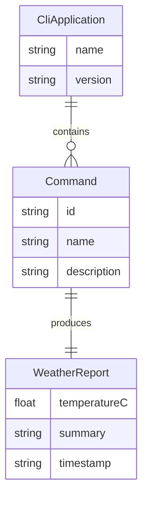

# Domain Model for ArchetypeNodeCLI

## Overview

ArchetypeNodeCLI operates in the developer tooling domain, providing a starter template and sample commands for building Node.js CLIs with TypeScript.

## Main Entities

### E1 CLI Application

Description: The overall CLI program exposing commands and options.

Attributes:
- name: string – CLI name and binary alias
- version: string – semantic version
- commands: Command[] – list of registered commands

### E2 Command

Description: An executable action in the CLI with its own options and handler.

Attributes:
- id: string – unique command identifier
- name: string – command name
- description: string – help text
- options: Option[] – command options
- handler: Function – implementation entry

### E3 WeatherReport

Description: Result entity for the sample business command.

Attributes:
- location: { lat: number; lon: number; city?: string; country?: string }
- temperatureC: number
- summary: string
- timestamp: string

## Entity Relationships

### R1 CLI Application ↔ Command

Relationship Type: One-to-Many
Description: A CLI application contains multiple commands.
Business Rule: Commands must be registered to be discoverable by help/version output.

### R2 Command ↔ WeatherReport

Relationship Type: One-to-One (per invocation)
Description: The weather command produces a WeatherReport from external API data.
Business Rule: The report must be validated before printing.

## Business Rules and Validations

### Data Validation Rules

1. Weather data
   - Latitude and longitude must be valid numeric ranges
   - Temperature must be a finite number

2. CLI input
   - Unknown options should be rejected or ignored according to parser policy
   - Required options (if any) must be present

### Business Operation Rules

1. External API usage
   - Respect HTTP errors and rate limits; show actionable messages
   - Timeouts must be handled gracefully

2. Output formatting
   - Use plain text, optionally colored, suitable for terminals
   - Never print secrets or raw tokens

## Entity-Relationship Diagram

## Additional Information

- Git repository: https://github.com/AIDDbot/ArchetypeNodeCLI
- PRD Document: ./PRD.md
- Systems Architecture: ./SYSTEMS.md
- Backlog of features: ./BACKLOG.md

> End of DOMAIN for ArchetypeNodeCLI, last updated on 2025-08-08.
