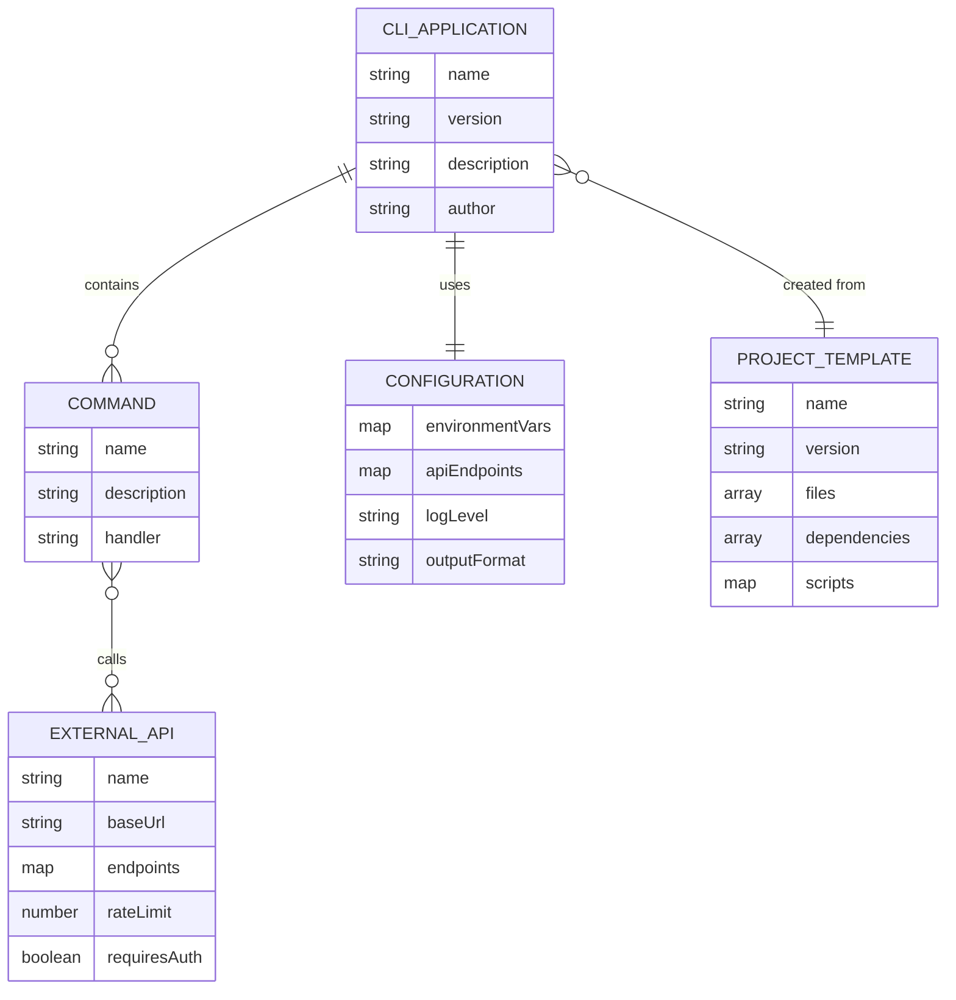

# Domain Model for ArchetypeNodeCLI

## Overview

**ArchetypeNodeCLI** operates in the software development tooling domain, managing CLI application templates, configurations, and command execution workflows for Node.js TypeScript projects.

## Main Entities

### E1 CLI Application

**Description:** Represents a command-line interface application created from the archetype template

**Attributes:**

- name: string - The name of the CLI application
- version: string - Semantic version of the application
- description: string - Brief description of what the CLI does
- author: string - Developer or organization that created the CLI
- commands: Command[] - Collection of available commands

### E2 Command

**Description:** Represents an executable command within the CLI application

**Attributes:**

- name: string - Command identifier (e.g., "weather", "help")
- description: string - Description of what the command does
- arguments: Argument[] - List of command arguments
- options: Option[] - List of command options/flags
- handler: Function - The executable logic for the command

### E3 Configuration

**Description:** Represents the application configuration settings and environment variables

**Attributes:**

- environmentVars: Map<string, string> - Environment variables loaded from .env file
- apiEndpoints: Map<string, string> - External API URLs and configurations
- logLevel: string - Logging level (debug, info, warn, error)
- outputFormat: string - Default output format (json, text, table)

### E4 External API

**Description:** Represents external services that the CLI integrates with

**Attributes:**

- name: string - API service name (e.g., "IP Geolocation", "Open Meteo")
- baseUrl: string - Base URL for the API
- endpoints: Map<string, string> - Available API endpoints
- rateLimit: number - Maximum requests per minute
- requiresAuth: boolean - Whether API requires authentication

### E5 Project Template

**Description:** Represents the archetype template structure and files

**Attributes:**

- name: string - Template name
- version: string - Template version
- files: TemplateFile[] - Collection of template files
- dependencies: Dependency[] - Required npm packages
- scripts: Map<string, string> - Package.json scripts

## Entity Relationships

### R1 CLI Application ↔ Command

**Relationship Type:** One-to-Many
**Description:** A CLI application contains multiple commands that users can execute
**Business Rule:** Each CLI application must have at least one command (help is always available)

### R2 CLI Application ↔ Configuration

**Relationship Type:** One-to-One
**Description:** Each CLI application has exactly one configuration instance
**Business Rule:** Configuration is loaded once at application startup and shared across all commands

### R3 Command ↔ External API

**Relationship Type:** Many-to-Many
**Description:** Commands can call multiple external APIs, and APIs can be used by multiple commands
**Business Rule:** API calls should be handled with proper error handling and rate limiting

### R4 CLI Application ↔ Project Template

**Relationship Type:** Many-to-One
**Description:** Multiple CLI applications can be created from the same archetype template
**Business Rule:** Template provides the foundation structure but each CLI can be customized

## Business Rules and Validations

### Data Validation Rules

1. **Command Validation**
   - Command names must be unique within a CLI application
   - Command names must follow kebab-case convention
   - All commands must have a description

2. **Configuration Validation**
   - Environment variables must be properly typed and validated
   - API endpoints must be valid URLs
   - Log levels must be one of: debug, info, warn, error

3. **Template Validation**
   - Template files must have valid file paths
   - Dependencies must specify valid semver versions
   - Scripts must be valid shell commands

### Business Operation Rules

1. **CLI Execution**
   - Commands must validate their arguments before execution
   - Error handling must provide helpful error messages
   - All external API calls must implement timeout and retry logic

2. **Template Usage**
   - Templates must generate valid Node.js TypeScript projects
   - Generated projects must pass all quality checks (ESLint, TypeScript)
   - Templates must include proper documentation and examples

## Entity-Relationship Diagram

## Additional Information

- [Git repository](https://github.com/AIDDbot/ArchetypeNodeCLI)
- [PRD Document](./PRD.md)
- [SYSTEMS Architecture](./SYSTEMS.md) *(to be created)*
- [BACKLOG of features](./BACKLOG.md) *(to be created)*

> End of DOMAIN for ArchetypeNodeCLI, last updated on August 7, 2025.
