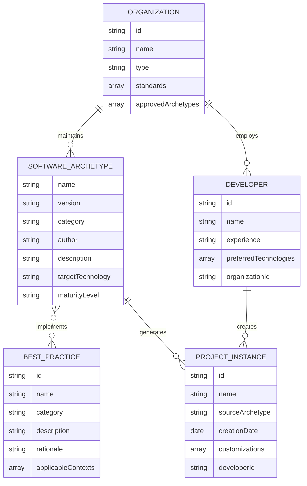

# Domain Model for ArchetypeNodeCLI

## Overview

**ArchetypeNodeCLI** operates in the **software archetype creation and distribution** domain, helping developers and organizations create, maintain, and share standardized project templates that accelerate software development and ensure consistency across teams.

## Main Entities

### E1 Software Archetype

**Description:** A standardized, reusable project template that embodies best practices, conventions, and proven patterns for a specific type of software development

**Attributes:**

- name: string - Unique identifier for the archetype (e.g., "node-cli", "react-spa")
- version: string - Semantic version following archetype evolution
- category: string - Type classification (CLI, Web App, API, Library)
- author: string - Creator or maintaining organization
- description: string - Purpose and intended use case
- targetTechnology: string - Primary technology stack (Node.js, React, etc.)
- maturityLevel: string - Development stage (experimental, stable, deprecated)

### E2 Developer

**Description:** Software developer or development team that creates new projects using archetypos

**Attributes:**

- id: string - Unique developer identifier
- name: string - Developer or team name
- experience: string - Skill level (beginner, intermediate, expert)
- preferredTechnologies: string[] - Familiar technology stacks
- organizationId: string - Associated organization (if applicable)

### E3 Organization

**Description:** Company, team, or community that creates, maintains, or standardizes archetypos

**Attributes:**

- id: string - Unique organization identifier
- name: string - Organization name
- type: string - Organization type (company, open-source, educational)
- standards: string[] - Coding standards and conventions enforced
- approvedArchetypes: string[] - List of sanctioned archetypos for use

### E4 Project Instance

**Description:** A concrete software project created from an archetype template

**Attributes:**

- id: string - Unique project identifier
- name: string - Project name chosen by developer
- sourceArchetype: string - Originating archetype name and version
- creationDate: Date - When project was generated
- customizations: string[] - Modifications made to the original archetype
- developerId: string - Creator of the project instance

### E5 Best Practice

**Description:** Proven development pattern, convention, or standard embedded within archetypos

**Attributes:**

- id: string - Unique practice identifier
- name: string - Practice name
- category: string - Type (coding standard, architecture pattern, tooling)
- description: string - What the practice addresses
- rationale: string - Why this practice is recommended
- applicableContexts: string[] - When this practice should be used

## Entity Relationships

### R1 Developer ↔ Project Instance

**Relationship Type:** One-to-Many
**Description:** A developer can create multiple projects from various archetypos
**Business Rule:** Each project must be traceable to its creator for support and learning purposes

### R2 Organization ↔ Software Archetype

**Relationship Type:** One-to-Many
**Description:** Organizations create and maintain archetypos that reflect their standards and practices
**Business Rule:** Organizations control the evolution and approval of their archetypos

### R3 Software Archetype ↔ Best Practice

**Relationship Type:** Many-to-Many
**Description:** Archetypos embody multiple best practices, and practices can be applied across different archetypos
**Business Rule:** Archetypos must implement at least basic best practices for their category

### R4 Software Archetype ↔ Project Instance

**Relationship Type:** One-to-Many
**Description:** An archetype serves as the template for creating multiple project instances
**Business Rule:** Project instances inherit the foundational structure and practices from their source archetype

### R5 Organization ↔ Developer

**Relationship Type:** One-to-Many
**Description:** Organizations employ or collaborate with developers who use approved archetypos
**Business Rule:** Developers should use organization-approved archetypos when working on organizational projects

## Business Rules and Validations

### Data Validation Rules

1. **Archetype Quality Standards**
   - Archetypos must pass automated quality checks before publication
   - Version numbers must follow semantic versioning principles
   - All archetypos must include comprehensive documentation

2. **Developer Usage Rules**
   - Developers must specify intended use case when selecting an archetype
   - Project customizations should be documented for future reference
   - Generated projects must acknowledge their source archetype

3. **Organization Governance**
   - Organizations can only approve archetypos that meet their standards
   - Archetype authors must be verified members of the organization
   - Deprecated archetypos must provide migration paths to newer versions

### Business Operation Rules

1. **Archetype Lifecycle Management**
   - New archetypos start in experimental status before becoming stable
   - Breaking changes require major version increments
   - Deprecated archetypos must remain available for existing projects

2. **Knowledge Transfer and Learning**
   - Archetypos should accelerate project setup while teaching best practices
   - Documentation must explain the reasoning behind included patterns
   - Success metrics include developer productivity and code quality improvements

## Entity-Relationship Diagram

## Additional Information

- [Git repository](https://github.com/AIDDbot/ArchetypeNodeCLI)
- [PRD Document](./PRD.md)
- [SYSTEMS Architecture](./SYSTEMS.md) *(to be created)*
- [BACKLOG of features](./BACKLOG.md) *(to be created)*

> End of DOMAIN for ArchetypeNodeCLI, last updated on August 7, 2025.
