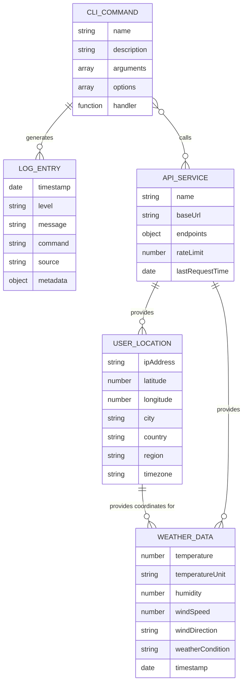

# Domain Model for ArchetypeNodeCLI

## Overview

**ArchetypeNodeCLI** operates in the **weather information services** domain, providing users with location-based weather data through a command-line interface. The system automatically detects user location via IP geolocation and retrieves current weather conditions from external meteorological services.

## Main Entities

### E1 User Location

**Description:** Geographic location of the user determined through IP address geolocation

**Attributes:**

- ipAddress: string - User's current IP address
- latitude: number - Geographic latitude coordinate
- longitude: number - Geographic longitude coordinate
- city: string - City name where user is located
- country: string - Country name
- region: string - State or region name
- timezone: string - User's timezone identifier

### E2 Weather Data

**Description:** Current meteorological conditions for a specific location

**Attributes:**

- temperature: number - Current temperature in degrees
- temperatureUnit: string - Temperature unit (Celsius/Fahrenheit)
- humidity: number - Relative humidity percentage
- windSpeed: number - Wind speed
- windDirection: string - Wind direction (N, NE, E, SE, S, SW, W, NW)
- weatherCondition: string - Current weather description (sunny, cloudy, rainy, etc.)
- timestamp: Date - When the weather data was recorded

### E3 CLI Command

**Description:** Executable command within the weather CLI application

**Attributes:**

- name: string - Command identifier (e.g., "weather", "help")
- description: string - What the command does
- arguments: string[] - Required command arguments
- options: string[] - Optional command flags
- handler: Function - Command execution logic

### E4 Log Entry

**Description:** System log record for tracking operations and debugging

**Attributes:**

- timestamp: Date - When the log entry was created
- level: string - Log level (debug, info, warn, error)
- message: string - Log message content
- command: string - Which command generated the log
- source: string - Source component (CLI, API, etc.)
- metadata: object - Additional contextual information

### E5 API Service

**Description:** External service used to retrieve location or weather information

**Attributes:**

- name: string - Service name (e.g., "IP-API", "Open Meteo")
- baseUrl: string - Base URL for API requests
- endpoints: object - Available API endpoints
- rateLimit: number - Requests per minute limit
- lastRequestTime: Date - Timestamp of last API call

## Entity Relationships

### R1 User Location ↔ Weather Data

**Relationship Type:** One-to-Many
**Description:** A specific location can have multiple weather readings over time
**Business Rule:** Weather data is always associated with geographic coordinates from user location

### R2 CLI Command ↔ Log Entry

**Relationship Type:** One-to-Many
**Description:** Each command execution generates one or more log entries
**Business Rule:** All operations must be logged for debugging and monitoring purposes

### R3 API Service ↔ User Location

**Relationship Type:** One-to-Many
**Description:** IP geolocation service provides location data for multiple users
**Business Rule:** Location requests must respect API rate limits and handle failures gracefully

### R4 API Service ↔ Weather Data

**Relationship Type:** One-to-Many
**Description:** Weather API service provides meteorological data for multiple locations
**Business Rule:** Weather requests must include valid coordinates and handle API errors

### R5 CLI Command ↔ API Service

**Relationship Type:** Many-to-Many
**Description:** Commands may call multiple API services, and services can be used by different commands
**Business Rule:** API calls must implement proper error handling and timeout mechanisms

## Business Rules and Validations

### Data Validation Rules

1. **Location Data Validation**
   - IP addresses must be valid IPv4 or IPv6 format
   - Latitude must be between -90 and 90 degrees
   - Longitude must be between -180 and 180 degrees
   - Geographic location data must be consistent across fields

2. **Weather Data Validation**
   - Temperature values must be within reasonable ranges (-100°C to 60°C)
   - Humidity must be between 0% and 100%
   - Wind speed must be non-negative
   - Weather conditions must be from predefined set of valid states

3. **Command Input Validation**
   - Command names must follow established patterns
   - Arguments must be properly formatted for their expected types
   - Options/flags must be recognized by the command parser
   - Invalid inputs must provide helpful error messages

### Business Operation Rules

1. **API Rate Limiting**
   - Location requests limited to prevent IP geolocation API abuse
   - Weather requests must respect service rate limits
   - Failed API calls must implement exponential backoff retry strategy
   - API timeouts must be handled gracefully with fallback options

2. **Data Freshness and Caching**
   - Weather data should be considered stale after 30 minutes
   - Location data can be cached for the session duration
   - Cache misses should trigger new API requests
   - Stale data must be clearly indicated to users

3. **Error Handling and Logging**
   - All operations must be logged with appropriate severity levels
   - Network failures must be logged and communicated to users
   - API errors must be translated into user-friendly messages
   - Critical errors must be logged with full context for debugging

## Entity-Relationship Diagram

## Additional Information

- [Git repository](https://github.com/AIDDbot/ArchetypeNodeCLI)
- [PRD Document](./PRD.md)
- [SYSTEMS Architecture](./SYSTEMS.md)
- [BACKLOG of features](./BACKLOG.md) *(to be created)*

> End of DOMAIN for ArchetypeNodeCLI, last updated on August 7, 2025.
