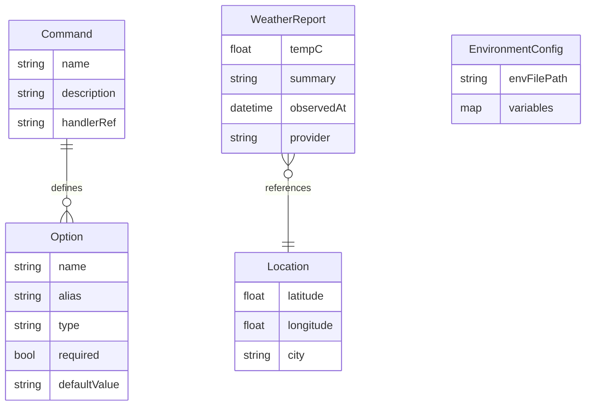

# Domain Model for Archetype Node CLI

## Overview

Archetype Node CLI operates in the developer tooling domain, providing a starter for building CLI applications that manage commands, options, environment configuration, and sample data retrieval (weather).

## Main Entities

### E1 Command

**Description:** A callable CLI action users invoke by name with options.

**Attributes:**

- name: string - Unique command identifier (e.g., "weather")
- description: string - Short help text
- options: Option[] - Available flags and parameters
- handlerRef: string - Reference to the implementation entry

### E2 Option

**Description:** A parameter or flag that modifies command behavior.

**Attributes:**

- name: string - Long name (e.g., "--units")
- alias: string - Short name (e.g., "-u")
- type: enum - { string | number | boolean }
- required: boolean - If the option must be provided
- defaultValue: string - Default when omitted

### E3 EnvironmentConfig

**Description:** Configuration values loaded from environment and `.env` files.

**Attributes:**

- envFilePath: string - Path to the env file used
- variables: map<string,string> - Key-value pairs available to the CLI

### E4 Location

**Description:** Geographical coordinates and human-readable place for weather lookup.

**Attributes:**

- latitude: number - Decimal degrees
- longitude: number - Decimal degrees
- city: string - Human-readable location if available

### E5 WeatherReport 

**Description:** Aggregated weather information retrieved from external APIs.

**Attributes:**

- tempC: number - Temperature in Celsius
- summary: string - Short description (e.g., "Clear")
- observedAt: datetime - Source timestamp
- provider: string - Data provider identifier

## Entity Relationships

### R1 Command ↔ Option

**Relationship Type:** One-to-Many
**Description:** A command defines multiple options; an option belongs to a single command.
**Business Rule:** Option names and aliases must be unique within a command.

### R2 WeatherReport ↔ Location

**Relationship Type:** Many-to-One
**Description:** Multiple reports can reference the same location.
**Business Rule:** A report must reference the location used to fetch it.

## Business Rules and Validations

### Data Validation

- All external API responses must be validated against schemas before use.
- Required options must be provided; otherwise, the command should error with guidance.

### Business Operation Rules

- Environment variables should be loaded and available before command execution.
- Network failures should not crash the CLI; show a clear error and exit non‑zero.

## Entity-Relationship Diagram

```mermaid
erDiagram
    Command ||--o{ Option : defines
    WeatherReport }o--|| Location : references
    Command {
      string name
      string description
      string handlerRef
    }
    Option {
      string name
      string alias
      string type
      bool required
      string defaultValue
    }
    EnvironmentConfig {
      string envFilePath
      map variables
    }
    Location {
      float latitude
      float longitude
      string city
    }
    WeatherReport {
      float tempC
      string summary
      datetime observedAt
      string provider
    }
```

## Additional Information

- [Git repository](https://github.com/AIDDbot/ArchetypeNodeCLI)
- [PRD Document](./PRD.md)
- [SYSTEMS Architecture](./SYSTEMS.md)
- [BACKLOG of features](./BACKLOG.md)

> End of DOMAIN for Archetype Node CLI, last updated on 2025-08-19.
