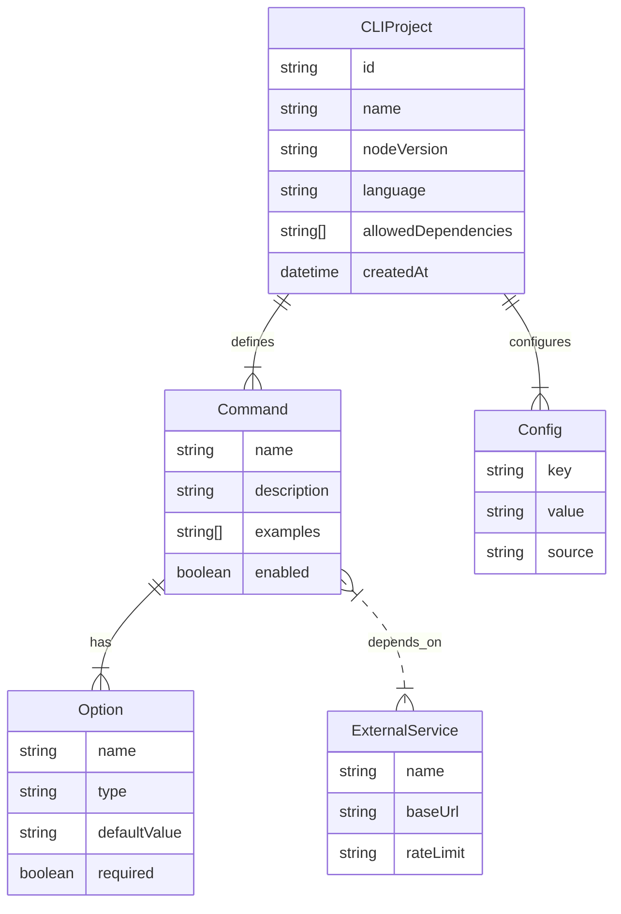

# Domain Model for Archetype Node CLI

## Overview

Archetype Node CLI operates in the developer tooling domain, managing CLI archetype concepts such as projects, commands, configuration, and external data providers to demonstrate sample features.

## Main Entities

### E1 CLIProject

**Description:** Represents an instance of a CLI project created from the archetype, including its metadata and allowed dependencies.

**Attributes:**

- id: string - Unique identifier for the project (e.g., repo slug).
- name: string - Project name.
- nodeVersion: string - Target Node.js version (e.g., "24.x").
- language: string - Primary language (TypeScript).
- allowedDependencies: string[] - Whitelisted libraries (chalk, commander, zod).
- createdAt: datetime - Creation timestamp.

### E2 Command

**Description:** A command exposed by the CLI (e.g., weather, help) with its behavior and output semantics.

**Attributes:**

- name: string - Command name.
- description: string - Brief explanation.
- examples: string[] - CLI usage examples.
- enabled: boolean - Whether the command is enabled by default.

### E3 Option

**Description:** A flag or parameter that modifies a command behavior.

**Attributes:**

- name: string - Option flag (e.g., --units, --json).
- type: string - Expected type (string | number | boolean | enum).
- defaultValue: string - Default value when not provided.
- required: boolean - Whether the option is mandatory.

### E4 Config

**Description:** Runtime configuration loaded via environment variables or files.

**Attributes:**

- key: string - Configuration key.
- value: string - Configuration value (non-secret in this archetype).
- source: string - Source (ENV, file).

### E5 ExternalService

**Description:** An external API provider used by sample features.

**Attributes:**

- name: string - Service name (IP Geolocation API, Open Meteo).
- baseUrl: string - Base URL of the service.
- rateLimit: string - Human-readable rate limit expectations.

## Entity Relationships

### R1 CLIProject ↔ Command

**Relationship Type:** One-to-Many
**Description:** A CLI project defines multiple commands.
**Business Rule:** A CLIProject must include at least the Help command; other sample commands are optional.

### R2 Command ↔ Option

**Relationship Type:** One-to-Many
**Description:** A command may define multiple options.
**Business Rule:** Required options must be validated before command execution.

### R3 Command ↔ ExternalService

**Relationship Type:** Many-to-Many
**Description:** Some commands depend on one or more external services (e.g., weather uses IP Geolocation and Open Meteo).
**Business Rule:** External calls should be resilient; failures must result in graceful messaging without secrets.

### R4 CLIProject ↔ Config

**Relationship Type:** One-to-Many
**Description:** The project can load multiple configuration entries from environment.
**Business Rule:** Configuration must be validated at startup; unsupported keys are ignored.

## Business Rules and Validations

### Data Validation 

- Only the dependencies chalk, commander, and zod are allowed; any other third-party dependency is rejected by policy.
- Environment loading must use `node --env-file=.env`; dotenv is not permitted.

### Business Operation Rules

- The archetype must run on Node.js v24 LTS; commands should leverage built-in features (fetch, test runner when applicable in examples).
- Sample features must not require secrets or paid accounts; outputs should be concise and human-readable.

## Entity-Relationship Diagram

```mermaid
erDiagram
    CLIProject ||--|{ Command : defines
    Command ||--|{ Option : has
    CLIProject ||--|{ Config : configures
    Command }|..|{ ExternalService : depends_on
    CLIProject {
      string id
      string name
      string nodeVersion
      string language
      string[] allowedDependencies
      datetime createdAt
    }
    Command {
      string name
      string description
      string[] examples
      boolean enabled
    }
    Option {
      string name
      string type
      string defaultValue
      boolean required
    }
    Config {
      string key
      string value
      string source
    }
    ExternalService {
      string name
      string baseUrl
      string rateLimit
    }
```

## Additional Information

- Git repository: https://github.com/AIDDbot/ArchetypeNodeCLI
- PRD Document: ./PRD.md
- SYSTEMS Architecture: ./SYSTEMS.md
- BACKLOG of features: ./BACKLOG.md

> End of DOMAIN for Archetype Node CLI, last updated on 2025-08-19.
