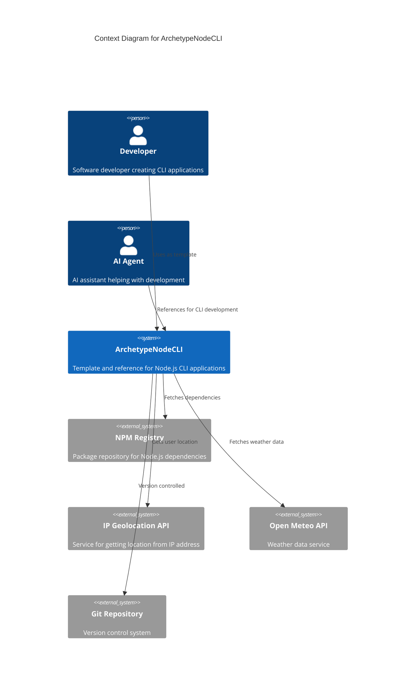

# Project Requirements Document for ArchetypeNodeCLI

## Overview

**ArchetypeNodeCLI** aims to provide a modern, standardized archetype for building Node.js command-line interfaces using TypeScript and 2025 best practices. This project serves as a template and reference implementation that developers and AI agents can use to quickly bootstrap new CLI applications with proper tooling, configuration, and structure.

### Goals

- **G1**: Create a reusable archetype that eliminates boilerplate setup for Node.js CLI projects
- **G2**: Demonstrate modern Node.js 2025 features and best practices without legacy dependencies
- **G3**: Provide practical examples through sample CLI commands (weather, help)
- **G4**: Enable rapid development of CLI applications with built-in quality tools and configurations
- **G5**: Serve as a learning resource for developers transitioning to modern Node.js development

## Requirements

### R1 Modern Node.js Foundation

The archetype must be built on Node.js V24 LTS with TypeScript, utilizing built-in modern features instead of external dependencies where possible (built-in test runner, fetch, env-file loading, etc.).

### R2 Essential CLI Framework

Must include a command-line interface framework (Commander.js) that allows easy extension with new commands, options, and help documentation.

### R3 Code Quality Tooling

Must include pre-configured ESLint and Prettier for code quality and formatting, ensuring consistent code style across projects using this archetype.

### R4 Sample Command Implementation

Must provide practical sample commands (weather command using IP geolocation and Open Meteo APIs) that demonstrate real-world CLI functionality and external API integration.

### R5 Development Experience

Must include development tools for watching file changes (`node --watch`) and direct TypeScript execution without compilation step (`node --disable-warning=ExperimentalWarning`).

### R6 Testing Framework

Must include testing setup using Node.js built-in test runner (`node:test`) with assertion library (`node:assert/strict`) without external testing dependencies.

### R7 Configuration Management

Must support environment variable loading using Node.js built-in `--env-file=.env` feature for configuration management while keeping secrets out of version control.

## Technical Constraints

- **Node.js Version**: Must be compatible with Node.js V24 LTS and newer versions
- **TypeScript**: Must use TypeScript for type safety and modern JavaScript features
- **Minimal Dependencies**: Only essential dependencies allowed (Chalk, Commander, Zod)
- **No Legacy Dependencies**: Explicitly avoid deprecated packages (dotenv, jest, node-fetch, nodemon, direct tsc usage)
- **External APIs**: Integration with IP Geolocation API and Open Meteo API for sample functionality
- **Platform**: Must work on Windows, macOS, and Linux environments
- **Version Control**: Must work with Git and include proper .gitignore for Node.js projects

### Context diagram

## Additional Information

- [Git repository](https://github.com/AIDDbot/ArchetypeNodeCLI)
- [Author: Alberto Basalo](https://albertobasalo.dev)
- [AIDDbot Organization](https://github.com/AIDDbot)
- [AI Code Academy](https://aicode.academy)
- [DOMAIN Models](./DOMAIN.md) *(to be created)*
- [SYSTEMS Architecture](./SYSTEMS.md) *(to be created)*
- [BACKLOG of features](./BACKLOG.md) *(to be created)*

> End of PRD for ArchetypeNodeCLI, last updated on August 7, 2025.
