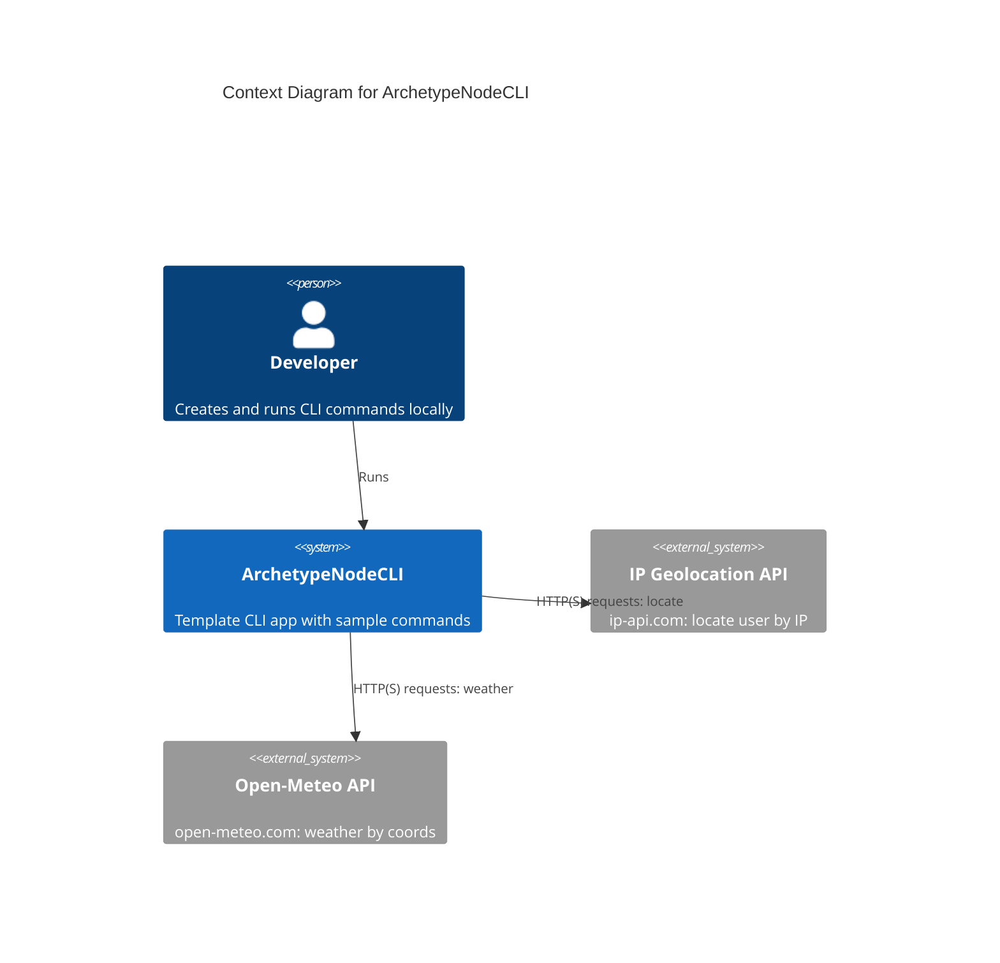

# Project Requirements Document for ArchetypeNodeCLI

## Overview

ArchetypeNodeCLI is an archetype for building modern Node.js command‑line interfaces (CLI) using TypeScript. It provides a structured setup with essential tools and configurations to streamline development. It includes a minimal but representative set of sample features to guide creation of your own CLI applications. It is intended primarily for learning and as a starting point, not as a production product.

### Goals

- Provide a ready‑to‑use Node.js 2025 CLI project template using TypeScript.
- Include a basic, extensible CLI with a help command and a sample business command (weather).
- Enforce code quality via ESLint and Prettier and promote modern Node built‑ins (fetch, node:test, env‑file, watch).
- Demonstrate environment configuration, logging, and simple external API integration.
- Ensure compatibility with Node.js v24 LTS and easy dependency updates.

## Requirements

### R1 Base project scaffolding

Provide TypeScript configuration, ESLint, and Prettier setup to ensure consistent code quality and formatting.

### R2 CLI entry point and help

Offer a CLI entry that exposes version and help output, listing available commands and options.

### R3 Sample weather command

Implement a weather command that determines the user location via IP geolocation and fetches current weather using Open‑Meteo, then prints a concise summary.

### R4 Environment management

Support reading environment variables from an .env file using Node’s built‑in `--env-file` flag (no dotenv dependency). Keep secrets out of VCS.

### R5 Logging and UX

Provide readable console output; use optional colorful output when available; keep error messages actionable.

### R6 Testing

Demonstrate unit tests using Node’s built‑in `node:test` and `node:assert/strict`. Include basic E2E smoke for CLI commands when feasible.

### R7 Documentation and maintenance

Include README usage notes, docs folder with architectural docs, and inline JSDoc for public APIs where applicable.

## Technical Constraints

- Runtime: Node.js v24 LTS; leverage modern features (built‑in `fetch`, `node:test`, `--env-file`, `--watch`).
- Language: TypeScript.
- Allowed libraries: Chalk (terminal colors), Commander (CLI parsing), Zod (validation).
- Deprecated/avoid: dotenv, jest, node-fetch, nodemon, standalone tsc build step (prefer running TS directly with Node’s flags).
- External services: IP Geolocation API (ip-api.com) and Open‑Meteo (open-meteo.com) for the sample command.
- Scope: Development environment usage only; not a production SaaS.

### Context diagram

## Additional Information

- Git repository: https://github.com/AIDDbot/ArchetypeNodeCLI
- Domain Models: ./DOMAIN.md
- Systems Architecture: ./SYSTEMS.md
 - [BACKLOG.md]() — to be created in Builder phase (Builder role)
 - Project Briefing: ./archetype-node_cli.briefing.md
 - README: ../README.md

> End of PRD for ArchetypeNodeCLI, last updated on 2025-08-08.
