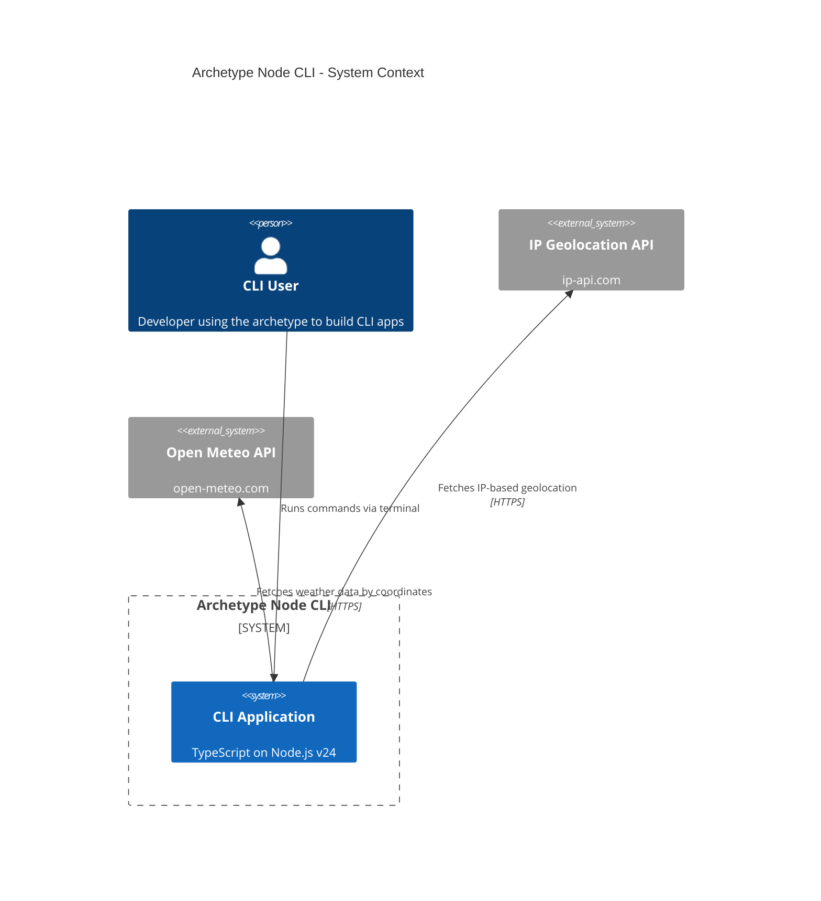

# Project Requirements Document for Archetype Node CLI

## Overview

Archetype Node CLI aims to provide a modern, opinionated archetype for building Node.js command-line interfaces (CLIs) with TypeScript. It delivers a structured setup, essential tooling, and sample features to accelerate learning and bootstrapping of new CLI projects, focusing on Node.js v24 capabilities and minimal dependencies.

### Goals 

- Offer a ready-to-use TypeScript CLI scaffold with curated configs (ESLint, Prettier).
- Demonstrate modern Node.js v24 features (built-in test runner, fetch, env-file, watch).
- Include example business commands (Weather, Help) to guide real-world usage.
- Provide documentation and test baselines to support maintainability.
- Keep dependencies minimal and upgradable; prefer Node built-ins.

## Requirements

### FR1 Template the CLI project

Provide a minimal, extensible CLI project structure using TypeScript, including scripts and configurations for development, linting, formatting, and running tests.

### FR2 Core CLI capabilities

- Parse commands and options using a standard CLI framework.
- Output colorful, readable terminal messages.
- Validate user input and configuration with runtime schemas.

### FR3 Sample business features

- Weather command: fetch current location via IP Geolocation API and retrieve weather via Open Meteo; print a concise, human-readable summary.
- Help command: display usage, available commands, and examples.

### FR4 Environment and configuration

- Support loading environment variables using `node --env-file=.env` (no dotenv).
- Document required and optional environment variables, if any.

### NFR1 Compatibility and currency

- Compatible with Node.js v24 LTS; keep dependencies up-to-date to latest stable versions.

### NFR2 Minimalism and maintainability

- Prefer Node built-ins over third-party packages; only allow Chalk, Commander, and Zod.
- Enforce code quality via ESLint and formatting via Prettier.

### NFR3 Scope and non-production intent

- Intended for learning and bootstrapping; non-production by default.
- Example integrations must avoid secrets and work without paid services.

## Technical Constraints

- Runtime: Node.js v24 LTS only.
- Language: TypeScript.
- Allowed dependencies: chalk (terminal colors), commander (CLI), zod (schema validation).
- Deprecated/avoid: dotenv (use `--env-file`), jest (use node:test), node-fetch (use built-in fetch), nodemon (use `node --watch`), tsc-only builds (prefer direct TS execution with Node flags as documented).
- Logging/monitoring via `console` only; no external logging stacks.

### System C4 Context diagram

```mermaid
C4Context
title Archetype Node CLI - System Context
Person(user, "CLI User", "Developer using the archetype to build CLI apps")
System_Boundary(cli, "Archetype Node CLI"){
  System(app, "CLI Application", "TypeScript on Node.js v24")
}
System_Ext(ipApi, "IP Geolocation API", "ip-api.com")
System_Ext(meteo, "Open Meteo API", "open-meteo.com")
Rel(user, app, "Runs commands via terminal")
Rel(app, ipApi, "Fetches IP-based geolocation", "HTTPS")
Rel(app, meteo, "Fetches weather data by coordinates", "HTTPS")
```

## Additional Information

- Git repository: https://github.com/AIDDbot/ArchetypeNodeCLI
- DOMAIN Models: ./DOMAIN.md
- SYSTEMS Architecture: ./SYSTEMS.md
- BACKLOG of features: ./BACKLOG.md

> End of PRD for Archetype Node CLI, last updated on 2025-08-19.
