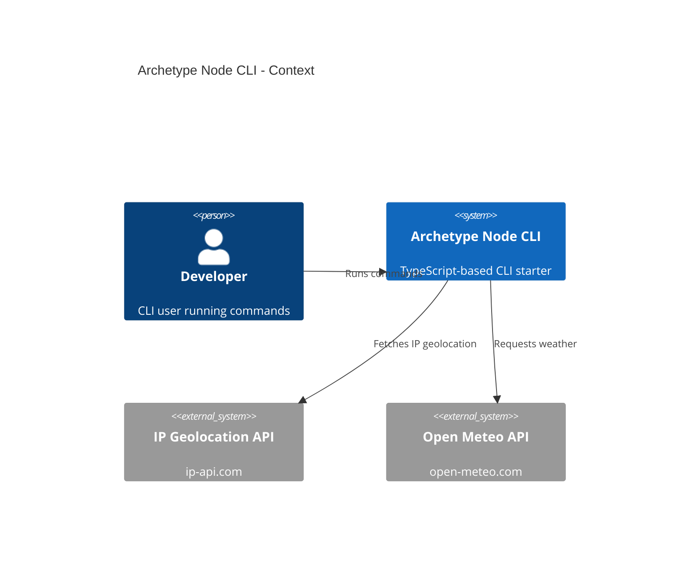

# Project Requirements Document for Archetype Node CLI

## Overview

Archetype Node CLI aims to provide a structured, TypeScript-based starter for building modern Node.js command‑line applications. It focuses on minimal, updatable dependencies, Node v24 built‑ins, and a small set of sample commands to guide implementation.

### Goals

- Accelerate CLI development by offering a clean, opinionated setup (TypeScript, ESLint, Prettier, testing, logging).
- Demonstrate essential CLI patterns through simple sample commands (help, weather).
- Favor Node v24 built‑in capabilities over legacy dependencies to reduce maintenance and complexity.
- Keep runtime and tooling dependencies minimal and up‑to‑date.
- Provide clear documentation and tests suitable for learning and reuse.

## Requirements

### R1 Core CLI framework and help
Provide a CLI entrypoint with structured commands, flags, and `--help`. Use Commander for command parsing and Chalk for readable, colored output.

### R2 Environment configuration
Support environment configuration via Node’s `--env-file=.env`. Do not use `dotenv`. Ensure `.env` is ignored by git.

### R3 Logging and monitoring
Offer consistent `console` logging conventions with optional colored output. Keep it simple and dependency‑light.

### R4 Weather sample command
Implement a sample command that:
- Retrieves IP geolocation from ip-api.com.
- Fetches weather from open-meteo.com using the obtained coordinates.
- Displays a concise summary and handles network or parsing errors gracefully.

### R5 Input validation
Use Zod to validate command options and inputs, providing clear, actionable error messages.

### R6 Testing and quality
Use Node’s built‑in test runner (`node:test`) and `node:assert/strict` for unit tests; include an end‑to‑end test for the CLI. Maintain ESLint and Prettier configurations for consistent style.

### R7 Documentation
Maintain up‑to‑date documentation: README for quick start and usage, `docs` for deeper architectural notes, and JSDoc for public APIs.

## Technical Constraints

- Runtime: Node.js v24 (modern features).
- Language: TypeScript; prefer running TS directly with Node where possible for development.
- Libraries: Commander (CLI), Chalk (output), Zod (validation).
- Avoid deprecated/legacy deps: `dotenv`, `jest`, `node-fetch`, `nodemon`, and a dedicated `tsc` build step for dev loops.
- Environment: Development only; not intended for production deployment.
- Networking: Use global `fetch`.
- External services: ip-api.com (IP geolocation) and open-meteo.com (weather data).

### System C4 Context diagram

```mermaid
C4Context
  title Archetype Node CLI - Context
  Person(dev, "Developer", "CLI user running commands")
  System(cli, "Archetype Node CLI", "TypeScript-based CLI starter")
  System_Ext(ipgeo, "IP Geolocation API", "ip-api.com")
  System_Ext(openmeteo, "Open Meteo API", "open-meteo.com")
  Rel(dev, cli, "Runs commands")
  Rel(cli, ipgeo, "Fetches IP geolocation")
  Rel(cli, openmeteo, "Requests weather")
```

## Additional Information

- Git repository: https://github.com/AIDDbot/ArchetypeNodeCLI
- DOMAIN Models: ./DOMAIN.md
- SYSTEMS Architecture: ./SYSTEMS.md
- BACKLOG of features: ./BACKLOG.md

> End of PRD for Archetype Node CLI, last updated on 2025-08-19.
