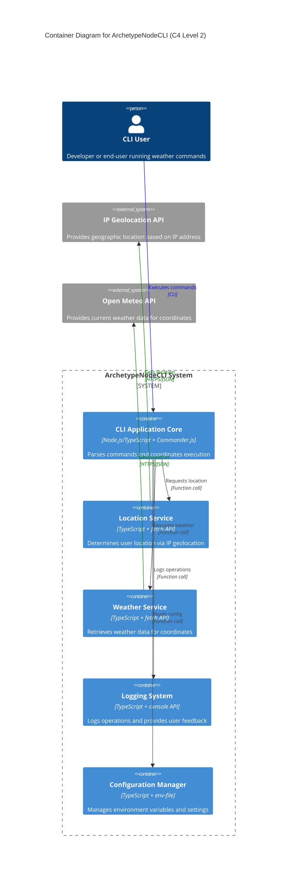

# Systems Architecture for ArchetypeNodeCLI

## Overview

**ArchetypeNodeCLI** follows a **modular CLI architecture**, designed for **simplicity and maintainability** with a **modern Node.js 2025 approach** that leverages built-in features instead of external dependencies.

## System Components

### S1 CLI Application Core

**Purpose:** Main application entry point that initializes the CLI framework and handles command routing

**Technology Stack:**

- **Language**: TypeScript
- **Framework**: Commander.js
- **Key Libraries**: Chalk (output formatting), Zod (schema validation)

**Responsibilities:**

- Parse command-line arguments and options
- Route commands to appropriate handlers
- Handle global error catching and logging
- Initialize application configuration

### S2 Location Service

**Purpose:** Manages IP-based geolocation functionality to determine user's current location

**Technology Stack:**

- **Language**: TypeScript
- **HTTP Client**: Node.js built-in fetch API
- **Key Libraries**: Zod (API response validation)

**Responsibilities:**

- Detect user's IP address automatically
- Call IP geolocation API (ip-api.com) to get location data
- Validate and transform location response data
- Cache location data for session duration

### S3 Weather Service

**Purpose:** Retrieves current weather conditions based on geographic coordinates

**Technology Stack:**

- **Language**: TypeScript
- **HTTP Client**: Node.js built-in fetch API
- **Key Libraries**: Zod (API response validation)

**Responsibilities:**

- Call Open Meteo API with latitude/longitude coordinates
- Parse and validate weather data responses
- Transform weather data into user-friendly format
- Handle API rate limiting and error cases

### S4 Logging System

**Purpose:** Comprehensive logging system for debugging and monitoring CLI operations

**Technology Stack:**

- **Language**: TypeScript
- **Runtime**: Node.js built-in console API
- **Key Libraries**: Chalk (colored output)

**Responsibilities:**

- Log all CLI operations with appropriate severity levels
- Format log messages with timestamps and context
- Provide colored console output for different log levels
- Track command execution flow and API calls

### S5 Configuration Manager

**Purpose:** Handles environment variables and application configuration settings

**Technology Stack:**

- **Language**: TypeScript
- **Environment Loading**: Node.js built-in --env-file feature
- **Key Libraries**: Zod (configuration validation)

**Responsibilities:**

- Load environment variables from .env files
- Validate configuration schema
- Provide type-safe configuration access
- Handle missing or invalid configuration gracefully

## Data Layer

### Data Storage Approach

**Database Type:** No persistent database (stateless CLI application)
**Technology:** In-memory data structures and session-based caching

**Data Access Patterns:**

- **Session Cache**: Temporary storage for location data during CLI execution
- **API Response Caching**: 30-minute TTL for weather data to avoid unnecessary API calls
- **Configuration Loading**: Environment variables loaded once at startup

**Key Design Decisions:**

- Stateless design eliminates need for persistent database
- In-memory caching improves performance while respecting API rate limits
- Configuration loaded from environment follows 12-factor app principles

## Integration Patterns

### I1 IP Geolocation API Integration

**Type:** REST API
**Purpose:** Automatic detection of user's geographic location based on IP address
**Protocol:** HTTPS
**Data Format:** JSON
**Endpoint:** http://ip-api.com/json/
**Rate Limit:** No authentication required, reasonable usage expected

### I2 Weather Data API Integration

**Type:** REST API
**Purpose:** Retrieve current weather conditions for specific coordinates
**Protocol:** HTTPS
**Data Format:** JSON
**Endpoint:** https://api.open-meteo.com/v1/current
**Rate Limit:** No authentication required, 10,000 requests/day limit

### I3 Error Handling Strategy

**Type:** Centralized error handling
**Purpose:** Consistent error processing across all integrations
**Protocol:** Internal error propagation
**Data Format:** Structured error objects with context

## Security Architecture

### Authentication & Authorization

**Authentication Method:** No authentication required (public APIs)
**Session Management:** No user sessions (stateless application)
**Authorization Pattern:** No authorization required

### Security Considerations

**API Security:**
- All external API calls use HTTPS
- No sensitive user data is transmitted
- No API keys or authentication tokens required

**Input Validation:**
- All command arguments validated before processing
- API responses validated with Zod schemas
- Geographic coordinates validated within reasonable ranges

**Data Privacy:**
- No personal data stored persistently
- IP address only used for geolocation, not stored
- Weather data cached temporarily in memory only

## System Architecture Diagram



## Development and Build Architecture

### Development Workflow

**Development Server:** Node.js with --watch flag for auto-restart
**TypeScript Execution:** Direct execution with --disable-warning=ExperimentalWarning
**Testing Framework:** Node.js built-in test runner with node:test and node:assert/strict
**Code Quality:** ESLint + Prettier with pre-configured rules

### Build and Distribution

**Build Process:** No compilation step required (direct TypeScript execution)
**Package Management:** npm with minimal dependencies (Commander, Chalk, Zod only)
**Distribution:** npm package for easy installation and usage
**Deployment:** Global CLI installation via npm install -g

### Project Structure

```
src/
├── commands/           # Command implementations
│   ├── weather.ts     # Weather command handler
│   └── help.ts        # Help command handler
├── services/          # Business logic services
│   ├── location.ts    # Location service
│   ├── weather.ts     # Weather service
│   └── logging.ts     # Logging service
├── types/             # TypeScript type definitions
│   ├── location.ts    # Location data types
│   └── weather.ts     # Weather data types
├── utils/             # Utility functions
│   └── config.ts      # Configuration management
└── main.ts            # Application entry point

tests/                 # Test files using node:test
├── commands/          # Command tests
├── services/          # Service tests
└── integration/       # Integration tests

docs/                  # Documentation
config/                # Configuration files
├── .eslintrc.json     # ESLint configuration
├── .prettierrc        # Prettier configuration
└── tsconfig.json      # TypeScript configuration
```

## Additional Information

- [Git repository](https://github.com/AIDDbot/ArchetypeNodeCLI)
- [PRD Document](./PRD.md)
- [DOMAIN Models](./DOMAIN.md)
- [BACKLOG of features](./BACKLOG.md) *(to be created)*

> End of SYSTEMS for ArchetypeNodeCLI, last updated on August 7, 2025.
