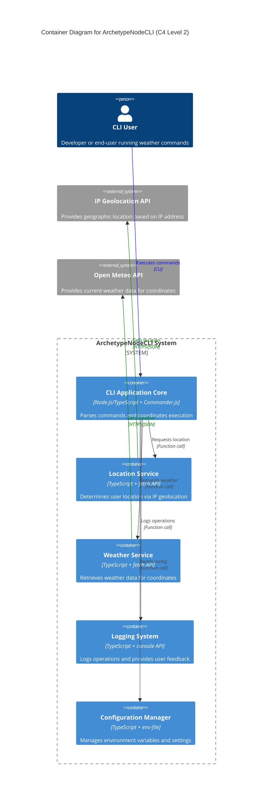

# Systems Architecture for ArchetypeNodeCLI

## Overview

**ArchetypeNodeCLI** follows a **modular CLI architecture**, designed for **simplicity and maintainability** with a **modern Node.js 2025 approach** that leverages built-in features instead of external dependencies.

## System Components

### S1 CLI Core (`src/core/`)

**Purpose:** Application initialization and command registration

**Technology Stack:** TypeScript + Commander.js + Zod

**Responsibilities:**
- Register all available commands
- Initialize global configuration
- Handle global error catching

### S2 Weather Feature (`src/commands/weather/`)

**Purpose:** Complete weather functionality including location detection and weather retrieval

**Technology Stack:** TypeScript + Built-in fetch + Zod validation

**Responsibilities:**
- Implement weather command handler
- Manage IP geolocation and weather API calls
- Transform and display weather data

### S3 Shared Services (`src/shared/`)

**Purpose:** Reusable utilities and API integrations

**Technology Stack:** TypeScript + Built-in APIs + Chalk

**Responsibilities:**
- API clients for external services
- Logging system with colored output
- Common type definitions and utilities

## Data Layer

### Data Storage Approach

**Database Type:** No persistent database (stateless CLI application)
**Technology:** In-memory data structures and session-based caching

**Data Access Patterns:**

- **Session Cache**: Temporary storage for location data during CLI execution
- **API Response Caching**: 30-minute TTL for weather data to avoid unnecessary API calls
- **Configuration Loading**: Environment variables loaded once at startup

**Key Design Decisions:**

- Stateless design eliminates need for persistent database
- In-memory caching improves performance while respecting API rate limits
- Configuration loaded from environment follows 12-factor app principles

## Integration Patterns

### I1 IP Geolocation API Integration

**Type:** REST API
**Purpose:** Automatic detection of user's geographic location based on IP address
**Protocol:** HTTPS
**Data Format:** JSON
**Endpoint:** http://ip-api.com/json/
**Rate Limit:** No authentication required, reasonable usage expected

### I2 Weather Data API Integration

**Type:** REST API
**Purpose:** Retrieve current weather conditions for specific coordinates
**Protocol:** HTTPS
**Data Format:** JSON
**Endpoint:** https://api.open-meteo.com/v1/current
**Rate Limit:** No authentication required, 10,000 requests/day limit

### I3 Error Handling Strategy

**Type:** Centralized error handling
**Purpose:** Consistent error processing across all integrations
**Protocol:** Internal error propagation
**Data Format:** Structured error objects with context

## Security Architecture

### Authentication & Authorization

**Authentication Method:** No authentication required (public APIs)
**Session Management:** No user sessions (stateless application)
**Authorization Pattern:** No authorization required

### Security Considerations

**API Security:**
- All external API calls use HTTPS
- No sensitive user data is transmitted
- No API keys or authentication tokens required

**Input Validation:**
- All command arguments validated before processing
- API responses validated with Zod schemas
- Geographic coordinates validated within reasonable ranges

**Data Privacy:**
- No personal data stored persistently
- IP address only used for geolocation, not stored
- Weather data cached temporarily in memory only

## System Architecture Diagram



## Development and Build Architecture

### Development Workflow

**Simplified Development Setup:**
- **TypeScript Execution**: Direct execution with `node --loader tsx src/core/cli.ts`
- **Development Mode**: `node --loader tsx --watch src/core/cli.ts` for auto-restart
- **Testing**: `node --test tests/**/*.test.ts` (built-in test runner)
- **Code Quality**: `npx eslint src/` and `npx prettier --write src/`

**No Build Step Required**: TypeScript files execute directly, eliminating compilation complexity

### Build and Distribution

**Simplified Build Process:**
- **No Compilation**: Direct TypeScript execution eliminates build step
- **Package Management**: `npm` with only 3 production dependencies (Commander, Chalk, Zod)
- **Distribution**: Standard npm package with TypeScript source files
- **Installation**: `npm install -g archetype-node-cli`
- **Execution**: `weather-cli` command available globally after installation

**Package.json Scripts:**
```json
{
  "scripts": {
    "start": "node --loader tsx src/core/cli.ts",
    "dev": "node --loader tsx --watch src/core/cli.ts",
    "test": "node --test tests/**/*.test.ts",
    "lint": "eslint src/",
    "format": "prettier --write src/"
  }
}
```

### Project Structure

Following **screaming architecture** principles, the project is organized by feature/functionality rather than technical type:

```
src/
├── core/                    # Core application logic and initialization
│   ├── cli.ts              # Main CLI setup with Commander.js
│   └── config.ts           # Configuration management and validation
├── commands/               # Feature-based command handlers
│   ├── weather/            # Weather functionality
│   │   ├── weather.command.ts    # Weather command implementation
│   │   ├── weather.service.ts    # Weather business logic
│   │   └── weather.types.ts      # Weather-specific types
│   └── help/               # Help functionality
│       └── help.command.ts       # Help command implementation
└── shared/                 # Shared utilities and components
    ├── api/                # External API integrations
    │   ├── location.api.ts        # IP geolocation API client
    │   └── weather.api.ts         # Weather API client
    ├── logger/             # Logging utilities
    │   └── logger.service.ts      # Centralized logging system
    └── types/              # Shared type definitions
        ├── location.types.ts      # Location data types
        └── common.types.ts        # Common shared types

tests/                      # Test files using node:test
├── commands/               # Command-specific tests
│   └── weather/           # Weather command tests
└── shared/                # Shared utilities tests
    ├── api/               # API integration tests
    └── logger/            # Logger tests

.env.example               # Environment variables template
package.json               # Dependencies and scripts
tsconfig.json             # TypeScript configuration
.eslintrc.json            # ESLint configuration
.prettierrc               # Prettier configuration
```

### Architectural Layers

The application follows a **3-layer logical architecture**:

#### 1. Presentation Layer (Commands)
- **Location**: `src/commands/*/`
- **Responsibility**: Handle CLI input, validation, and output formatting
- **Components**: Command handlers that parse arguments and coordinate business logic

#### 2. Business Layer (Services)
- **Location**: `src/commands/*/` (co-located with commands)
- **Responsibility**: Core business logic and data transformation
- **Components**: Service classes that orchestrate API calls and data processing

#### 3. Integration Layer (Shared APIs)
- **Location**: `src/shared/api/`
- **Responsibility**: External API communication and data access
- **Components**: API clients that handle HTTP calls and response validation

### Simplified Development Approach

**Single Entry Point**: `src/core/cli.ts` registers all commands
**Co-location**: Related functionality grouped together (commands + services + types)
**Minimal Dependencies**: Only essential packages (Commander, Chalk, Zod)
**Direct Execution**: No build step required with `node --loader tsx`
**Built-in Testing**: Node.js native test runner eliminates external test dependencies

## Additional Information

- [Git repository](https://github.com/AIDDbot/ArchetypeNodeCLI)
- [PRD Document](./PRD.md)
- [DOMAIN Models](./DOMAIN.md)
- [BACKLOG of features](./BACKLOG.md) *(to be created)*

> End of SYSTEMS for ArchetypeNodeCLI, last updated on August 7, 2025.
