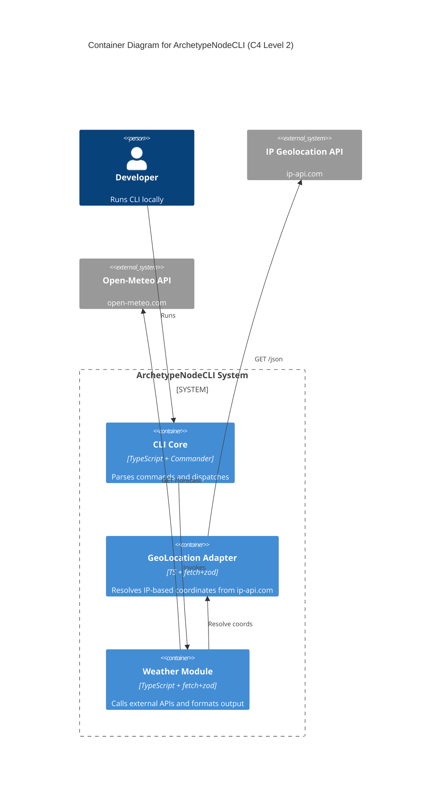

# Systems Architecture for ArchetypeNodeCLI

## Overview

ArchetypeNodeCLI follows a simple modular CLI architecture, designed for local developer experience with modern Node 2025 capabilities and minimal external dependencies.

## System Components

### S1 CLI Core

Purpose: Entry point that wires parsing, routing, and shared concerns (logging, env).

Technology Stack:
- Language: TypeScript
- Framework: None (CLI composition with Commander)
- Key Libraries: commander, chalk, zod (for sample validation)

Responsibilities:
- Bootstrap CLI and register commands
- Provide help/version
- Handle top‑level errors gracefully

### S2 Weather Feature Module

Purpose: Demonstrate external API integration and basic validation/formatting.

Technology Stack:
- Language: TypeScript
- Libraries: fetch (Node built‑in), zod

Responsibilities:
- Resolve coordinates via IP Geolocation API (ip-api.com)
- Fetch current weather from Open‑Meteo
- Validate and map responses to WeatherReport
- Print a concise summary

### S3 GeoLocation Adapter

Purpose: Abstract calls to ip-api.com and normalize geolocation data for the weather module.

Technology Stack:
- Language: TypeScript
- Libraries: fetch (Node built‑in), zod

Responsibilities:
- Call ip-api.com JSON endpoint to obtain lat/lon and location metadata
- Validate response schema and map to GeoLocation domain entity
- Surface clear errors and rate-limit handling

## Data Layer

No database. Transient data fetched at runtime from external APIs.

Data Access Patterns:
- HTTP GET with timeout and basic error handling
- Zod schemas ensure expected shapes

Key Design Decisions:
- Prefer Node built‑ins over third‑party packages
- Keep modules small and composable

## Integration Patterns

### I1 HTTP integrations

Type: REST API
Purpose: Retrieve geolocation (ip-api.com) and weather (Open‑Meteo)
Protocol: HTTPS
Data Format: JSON

## Security Architecture

Authentication: None for public endpoints used; avoid storing secrets.
Hardening:
- Validate inputs/outputs
- Handle errors without leaking stack traces by default in CLI output

## Tech Stack

Bill of Materials:
- Backend/CLI
  - Language: TypeScript
  - Framework: None (Commander for CLI parsing)
  - Libraries: commander, chalk, zod
  - Package manager: npm or pnpm (project agnostic)

Instructions
- Prefer instructions in `.github/instructions/frm-node_2025.instructions.md`, fallback to generic ones

## System Architecture Diagram

## Additional Information

- Git repository: https://github.com/AIDDbot/ArchetypeNodeCLI
- PRD Document: ./PRD.md
- Domain Models: ./DOMAIN.md
 - [BACKLOG.md]() — to be created in Builder phase (Builder role)
 - Project Briefing: ./archetype-node_cli.briefing.md
 - README: ../README.md

> End of SYSTEMS for ArchetypeNodeCLI, last updated on 2025-08-08.
