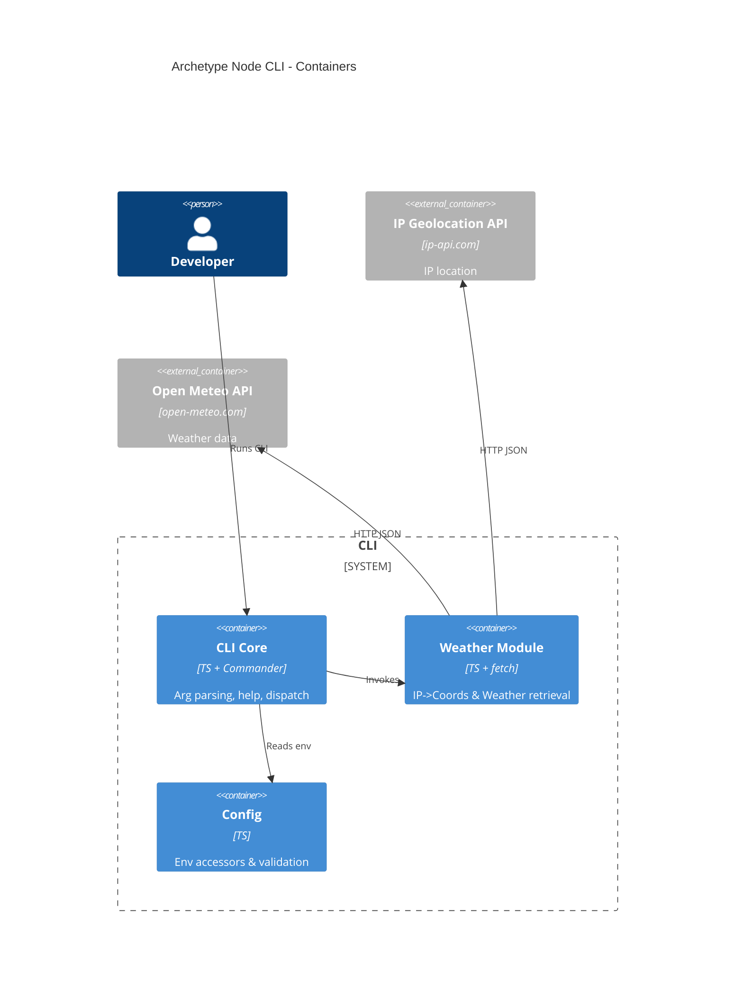

# Systems Architecture for Archetype Node CLI

## Overview

Archetype Node CLI follows a modular CLI architecture, designed for developer productivity and learning, with a TypeScript-first approach leveraging Node v24 built-ins.

## System Components

### S1 CLI Core

**Purpose:** Entry point, command registration, help/usage, and dispatch to handlers.

**Technology Stack:**

- **Language**: TypeScript
- **Framework**: Commander
- **Key Libraries**: Chalk, Zod
- **Other Packages**: None required beyond lint/format/test tooling

**Responsibilities:**

- Parse args and options, route to command handlers
- Provide help output and consistent UX conventions

### S2 Weather Integration

**Purpose:** Retrieve IP location and current weather summary.

**Technology Stack:**

- **Language**: TypeScript
- **Framework**: None (module)
- **Key Libraries**: Zod for schema validation
- **Other Packages**: Built-in fetch

**Responsibilities:**

- Call ip-api.com to resolve coordinates
- Call open-meteo.com with coordinates
- Validate and shape data for CLI output

### S3 Configuration & Env

**Purpose:** Load environment configuration using Node `--env-file` and expose variables to code.

**Technology Stack:**

- **Language**: TypeScript
- **Framework**: None (utility)
- **Key Libraries**: Zod for env schema

**Responsibilities:**

- Document how to pass `--env-file=.env`
- Provide typed accessors to env values

## Data Layer

### D1 Local Runtime State

**Database Type:** None (in-memory only)
**Technology:** N/A

**Data Access Patterns:**

- Read-only external API consumption
- Ephemeral in-memory data during command execution

**Key Design Decisions:**

- No persistence required for archetype scope
- Prefer pure functions and simple modules

## Integration Patterns

### I1 External Weather Data

**Type:** REST API
**Purpose:** Obtain location and weather data
**Protocol:** HTTP(S)
**Data Format:** JSON

## Security Architecture

### Authentication & Authorization

**Authentication Method:** None (public APIs used without auth keys for the sample)
**Session Management:** Not applicable
**Authorization Pattern:** Not applicable

## Systems Architecture Diagram

```mermaid
C4Container
  title Archetype Node CLI - Containers
  Person(dev, "Developer")
  System_Boundary(cli, "CLI") {
    Container(core, "CLI Core", "TS + Commander", "Arg parsing, help, dispatch")
    Container(weather, "Weather Module", "TS + fetch", "IP->Coords & Weather retrieval")
    Container(config, "Config", "TS", "Env accessors & validation")
  }
  Container_Ext(ipgeo, "IP Geolocation API", "ip-api.com", "IP location")
  Container_Ext(openmeteo, "Open Meteo API", "open-meteo.com", "Weather data")
  Rel(dev, core, "Runs CLI")
  Rel(core, weather, "Invokes")
  Rel(core, config, "Reads env")
  Rel(weather, ipgeo, "HTTP JSON")
  Rel(weather, openmeteo, "HTTP JSON")
```

## Additional Information

- [Git repository](https://github.com/AIDDbot/ArchetypeNodeCLI)
- [PRD Document](./PRD.md)
- [DOMAIN Models](./DOMAIN.md)
- [BACKLOG of features](./BACKLOG.md)

> End of SYSTEMS for Archetype Node CLI, last updated on 2025-08-19.
