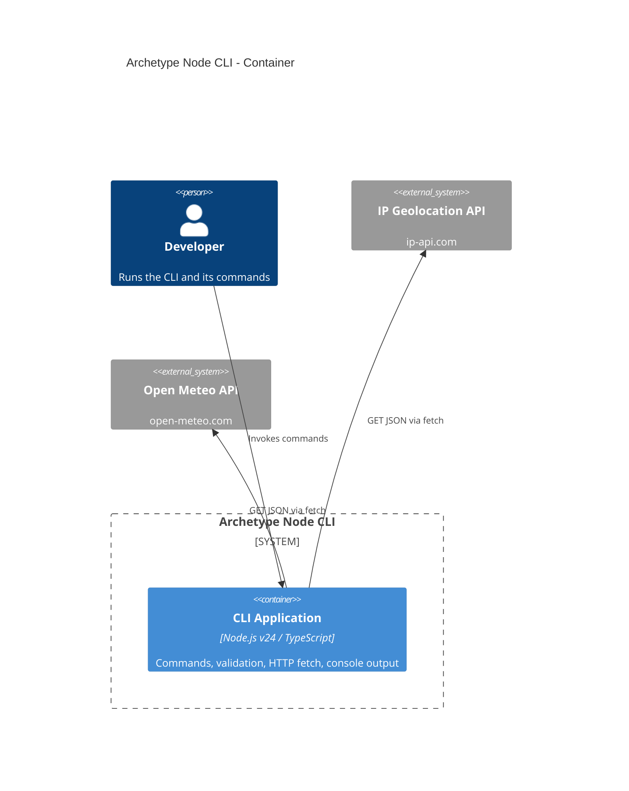

# Systems Architecture for Archetype Node CLI

## Overview

Archetype Node CLI follows a single-container, layered CLI architecture, designed for simplicity, maintainability, and minimal dependencies with a Node.js v24 + TypeScript approach leveraging modern built-ins.

## System Components

### S1 CLI Application

**Purpose:** Provide a TypeScript-based command-line interface with structured commands, options, validation, and example integrations (IP geolocation and weather retrieval).

**Technology Stack:**

- Language: type_script
- Framework: express | spring | .net → (none; CLI) using Commander
- Key Libraries: commander, chalk, zod
- Other Packages: Node.js v24 built-ins (fetch, test, `--env-file`)

**Responsibilities:**

- Parse commands and options, render help and usage
- Validate inputs and environment configuration
- Orchestrate calls to external HTTP APIs and format output
- Handle errors gracefully and exit with meaningful status codes

## Data Layer

### D1 Ephemeral In-Memory (No database)

**Database Type:** none (no persistence)
**Technology:** N/A

**Data Access Patterns:**

- Pass-through: Data retrieved from external APIs is validated and transformed in-memory, then output to console
- Caching (optional, in-memory): short-lived variables within a single run; no cross-run persistence

**Key Design Decisions:**

- Avoid a database to keep the archetype minimal and focused on CLI patterns
- Treat external API responses as read-only inputs validated via Zod

## Integration Patterns

### I1 IP Geolocation (ip-api.com)

**Type:** REST API
**Purpose:** Determine user location (approximate) for weather lookup
**Protocol:** HTTP(S)
**Data Format:** JSON

### I2 Weather (open-meteo.com)

**Type:** REST API
**Purpose:** Retrieve current weather data using coordinates
**Protocol:** HTTP(S)
**Data Format:** JSON

## Security Architecture

### Authentication & Authorization

**Authentication Method:** None (local CLI; no user accounts)
**Session Management:** N/A
**Authorization Pattern:** N/A

- Sensitive data handling: Environment variables loaded via Node's `--env-file` if needed; no secrets required by default
- Transport security: Prefer HTTPS endpoints for external API calls
- Privacy: Avoid logging personally identifiable information; keep output minimal

## Systems Architecture Diagram

```mermaid
C4Container
    title Archetype Node CLI - Container
    Person(dev, "Developer", "Runs the CLI and its commands")
    System_Boundary(cli, "Archetype Node CLI") {
      Container(app, "CLI Application", "Node.js v24 / TypeScript", "Commands, validation, HTTP fetch, console output")
    }

    System_Ext(ipgeo, "IP Geolocation API", "ip-api.com")
    System_Ext(openmeteo, "Open Meteo API", "open-meteo.com")

    Rel(dev, app, "Invokes commands")
    Rel(app, ipgeo, "GET JSON via fetch")
    Rel(app, openmeteo, "GET JSON via fetch")
```

## Additional Information

- Git repository: https://github.com/AIDDbot/ArchetypeNodeCLI
- PRD Document: ./PRD.md
- DOMAIN Models: ./DOMAIN.md
- BACKLOG of features: ./BACKLOG.md

> End of SYSTEMS for Archetype Node CLI, last updated on 2025-08-19.
