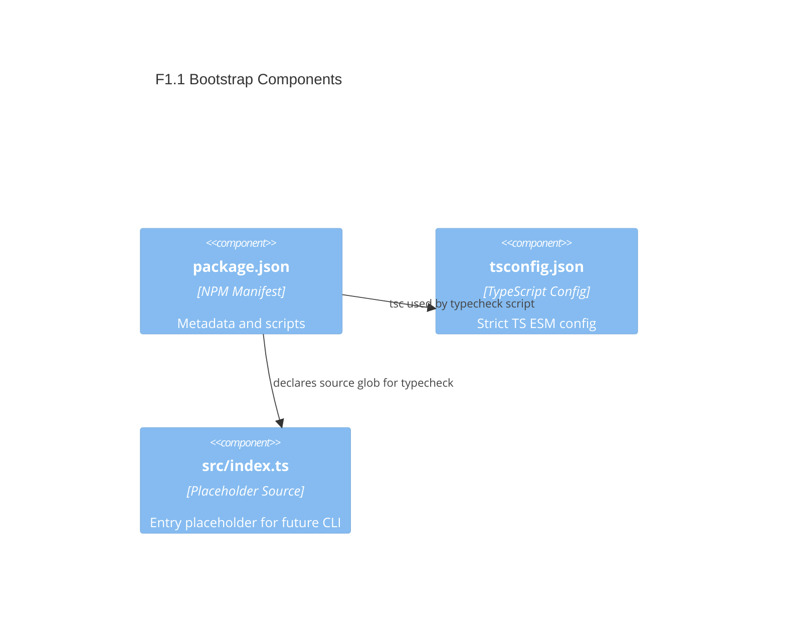

# F1.1 Initialize package and TypeScript config Design

## Overview

Bootstrap a minimal Node.js v24 + TypeScript CLI scaffold. Deliver package.json, tsconfig.json, and a conventional src/ structure without implementing executable CLI behavior yet. Keep dependencies minimal and ESM-only. Provide scripts for type checking and cleaning to enable future features.

## Data Models

### M1 ProjectMetadata (Input/Output)

- Purpose: Describe package metadata used by npm and tooling. Input to npm, output via `npm pkg get` and documentation.
- Tier / Layer: Tooling / Packaging

```json
{
  "name": "archetype-node-cli",
  "version": "0.0.0",
  "type": "module",
  "engines": { "node": ">=24" }
}
```

### M2 TypeScriptCompilerOptions (Input)

- Purpose: Configure strict, modern ESM TypeScript behavior. Used only for type checking at this stage.
- Tier / Layer: Build/Type System

```json
{
  "compilerOptions": {
    "target": "ES2022",
    "module": "ES2022",
    "moduleResolution": "Bundler",
    "types": ["node"],
    "strict": true,
    "noEmit": true,
    "skipLibCheck": true,
    "forceConsistentCasingInFileNames": true,
    "isolatedModules": true
  },
  "include": ["src/**/*.ts"],
  "exclude": ["node_modules", "dist"]
}
```

## Components

### C1 NPM Package Manifest

- Purpose: Minimal `package.json` with name, version, type=module, engines, and scripts for `typecheck` and `clean`.
- Interfaces: npm scripts: `npm run typecheck`, `npm run clean`
- Dependencies: None (avoid runtime deps now)
- Reuses: Node.js v24 built-ins

Public API (scripts):

```json
{
  "scripts": {
    "typecheck": "tsc -p tsconfig.json --noEmit",
    "clean": "node -e \"(async()=>{const fs=require('fs').promises; for (const p of ['dist']) { try { await fs.rm(p,{recursive:true,force:true}); } catch {} }})()\""
  }
}
```

### C2 TypeScript Configuration

- Purpose: Provide strict compiler options aligned with Node v24 ESM.
- Interfaces: `tsconfig.json`
- Dependencies: TypeScript (as a devDependency when added later); Node's type declarations
- Reuses: None

```json
{
  "extends": null,
  "compilerOptions": { "strict": true, "noEmit": true, "module": "ES2022", "target": "ES2022", "moduleResolution": "Bundler", "types": ["node"] }
}
```

### C3 Source Layout

- Purpose: Establish `src/` with a placeholder `index.ts` for future CLI wiring.
- Interfaces: File presence only; no runtime behavior required.
- Dependencies: None
- Reuses: None

```ts
// src/index.ts
export const placeholder = true;
```

## User interface

Command-line interface not implemented in this feature. Only developer-facing npm scripts:

- `typecheck`: runs the TypeScript compiler in type-check mode
- `clean`: removes build artifacts (anticipating future `dist/`)

## Aspects

### Monitoring

- None for this bootstrap. Future features will add logging. Keep npm script outputs clear and short.

### Security

- No secrets or external calls. Ensure `type=module` to avoid CommonJS pitfalls.

### Error Handling

- `npm run typecheck` should exit non-zero on TS errors. Scripts should be simple and cross-platform (Node one-liners rather than shell-specific commands).

## Architecture

Single-container CLI app per SYSTEMS. No runtime services in this feature. Focus on configuration artifacts enabling later layers (Commander, Chalk, Zod).

### Component Diagram



### File Structure

```plaintext
/ (repo root)
├─ package.json         # Minimal metadata and scripts (added by F1.1)
├─ tsconfig.json        # Strict TS config for Node v24 ESM
├─ src/
│  └─ index.ts          # Placeholder, no runtime behavior
└─ docs/
   └─ backlog/
      └─ F1.1.design.md # This document
```

> End of Feature Design for F1.1, last updated 2025-08-19.
