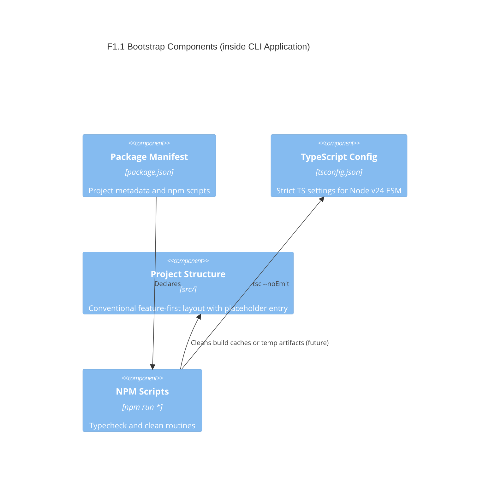

# F1.1 Initialize package and TypeScript config Design 

## Overview

Bootstrap a minimal, TypeScript-first Node v24 CLI foundation. This feature creates the baseline project artifacts: `package.json`, `tsconfig.json`, a conventional `src/` folder, and npm scripts for type checking and housekeeping. It doesn’t implement any CLI behavior yet; it enables future features to add commands cleanly.

## Architecture

Single-container CLI application (Node.js v24, ESM). No runtime dependencies are required at this stage. Keep the setup lean and conventional to fit the archetype’s opinionated defaults.

Key decisions:
- ESM-only (`type: module`) aligned with Node v24.
- Strict TypeScript configuration with `noEmit` for dev-only type checking.
- Minimal scripts: `typecheck` and `clean` to start; no build or run wiring yet.
- Conventional feature-first source layout with an empty `src/index.ts` placeholder.

### Component Diagram



## Components

### Package Manifest (package.json)

- Purpose: Define project metadata, ESM mode, engines, and minimal scripts.
- Interfaces: npm scripts (`typecheck`, `clean`), engines (Node >=24), type=module, private=true.
- Dependencies: None (no runtime deps); dev-only TypeScript.
- Reuses: Node/npm conventions.

### TypeScript Config (tsconfig.json)

- Purpose: Provide strict, modern TS settings compatible with Node v24 ESM.
- Interfaces: Consumed by `tsc` via `npm run typecheck`.
- Dependencies: TypeScript compiler.
- Reuses: Node + TS recommended settings.

### Project Structure (src/)

- Purpose: Establish a clear place for future CLI code.
- Interfaces: Exposes `src/index.ts` placeholder for future entry wiring.
- Dependencies: None.
- Reuses: Feature-first layout guidance from architecture docs.

### NPM Scripts

- Purpose: Developer ergonomics; quick checks and cleanup.
- Interfaces:
  - `npm run typecheck` → `tsc --noEmit`
  - `npm run clean` → remove temp artifacts (kept minimal; no build artifacts yet)
- Dependencies: TypeScript.
- Reuses: Standard npm script patterns.

## Data Models

Although no runtime data models are introduced, two configuration models are relevant:

### PackageJson

Purpose: Describe project metadata and scripts.

```json
{
  "name": "@aidd/archetype-node-cli",
  "version": "0.1.0",
  "private": true,
  "type": "module",
  "engines": { "node": ">=24" },
  "scripts": {
    "typecheck": "tsc --noEmit",
    "clean": "git clean -xdf -e node_modules"
  },
  "devDependencies": {
    "typescript": "^5.5.0"
  }
}
```

### TsConfig

Purpose: Ensure strict TS with Node v24 ESM target.

```json
{
  "compilerOptions": {
    "strict": true,
    "noEmit": true,
    "target": "ES2023",
    "module": "ESNext",
    "moduleResolution": "Bundler",
    "types": [],
    "lib": ["ES2023"],
    "skipLibCheck": true,
    "forceConsistentCasingInFileNames": true,
    "resolveJsonModule": true
  },
  "include": ["src/**/*.ts"],
  "exclude": ["node_modules", "dist"]
}
```

## User interface

No end-user CLI interface in this feature. Developer-facing scripts only:
- `npm run typecheck` to validate types.
- `npm run clean` to reset local workspace (non-destructive with node_modules excluded).

### Routes/Commands

None yet. Future features will introduce the CLI entrypoint and commands.

## Aspects

### Monitoring

Not applicable at this stage. Rely on TypeScript diagnostics output for feedback.

### Security

- No secrets or external calls. Keep repository free of tokens.
- Prefer `.gitignore` for environment files in later features.

### Error Handling

- `typecheck` exits with non-zero on TS errors to surface problems early.
- No runtime code to handle; failures are limited to tooling.

> End of Feature Design for F1.1, last updated 2025-08-19.
