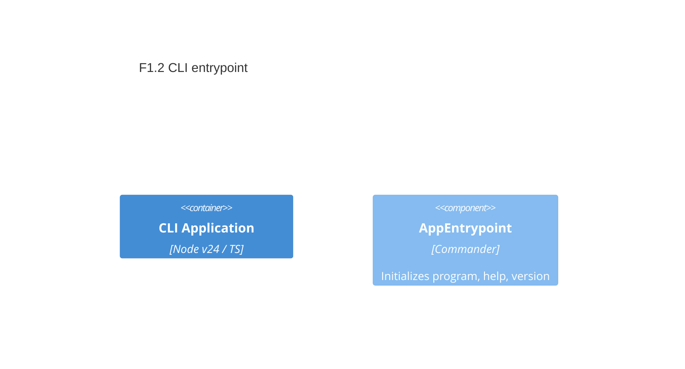

# F1.2 CLI entrypoint with Commander and help Design 

## Overview

Introduce a single CLI entrypoint using Commander to parse args, show `--help`, and print `--version`. Keep output plain for now (no Chalk) and wire version from package metadata once available. This lays the foundation for further commands (e.g., weather) and later colorized output.

## Data Models

### CLIInfo

- **Purpose:** Output; provides metadata used for `--version` and description in help
- **Tier / Layer:** CLI Application / core

```ts
// Pseudo-type for reference
interface CLIInfo {
  name: string;        // binary name shown in help
  description: string; // short description
  version: string;     // semantic version
}
```

## Components

### AppEntrypoint

- **Purpose:** Initialize Commander program, set name/description/version, and handle default help
- **Interfaces:**
  - run(argv?: string[]): Promise<number> // returns exit code
- **Dependencies:** Commander library; Node process for argv and exit code
- **Reuses:** None yet; later features may reuse shared logger/config

```ts
// Public API sketch
export async function run(argv = process.argv): Promise<number> {
  // configure Commander program and parse
  // return 0 on success, non-zero on handled error
}
```

## User interface

### Command: archetype-node

- **Purpose:** Top-level CLI command providing help and version
- **URL/Name:** archetype-node (bin name)

Interactions:
- `archetype-node --help` → prints usage with options and commands (none yet)
- `archetype-node --version` → prints version string
- `archetype-node` (no args) → prints help by default

## Aspects

### Monitoring

- Minimal console logging. For this feature, rely on Commander defaults; no custom logging.

### Security

- No sensitive data handled. No network calls. No env usage yet.

### Error Handling

- If version metadata cannot be loaded, print a readable message to stderr and return non-zero exit code.
- Let Commander handle unknown flags with its built-in error messages.

## Architecture

- Single-container CLI application.
- Layering stays simple: feature lives in `src/core/cli` (suggested) with an exported `run` and a small `bin` shim.

### Component Diagram



### File Structure

```plaintext
src/
  core/
    cli/
      run.ts          # implements run(argv)
  bin/
    archetype-node.ts # tiny shim calling run()
```

> End of Feature Design for F1.2, last updated 2025-08-19.
