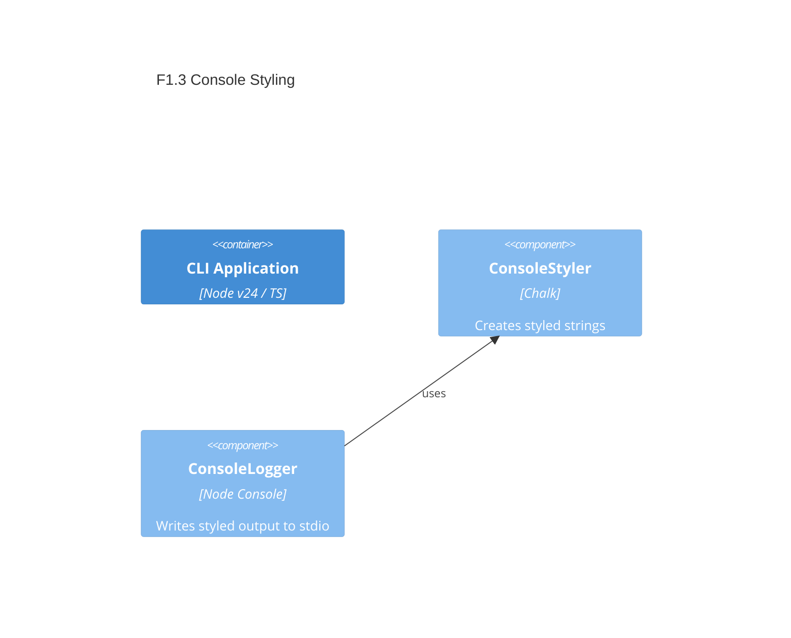

# F1.3 Chalk-powered console output Design 

## Overview

Introduce a centralized styling and logging utility powered by Chalk. Provide colorized, readable messages with graceful fallback to plain text when colors are not supported or disabled. Keep the API small and composable for reuse across future commands (e.g., weather).

## Data Models

### StyleConfig

- **Purpose:** Input; toggles and levels for color usage
- **Tier / Layer:** CLI Application / core

```ts
// Pseudo-type for reference
interface StyleConfig {
  useColor: boolean;      // resolved from environment and TTY
  level?: number;         // chalk level 0..3, optional override
}
```

## Components

### ConsoleStyler

- **Purpose:** Build styled strings for common message types
- **Interfaces:**
  - text: (s: string) => string // pass-through maybe styled
  - info: (s: string) => string
  - success: (s: string) => string
  - warn: (s: string) => string
  - error: (s: string) => string
- **Dependencies:** Chalk library (ESM)
- **Reuses:** None
  
```ts
// Public API sketch
export interface Styler {
  text(s: string): string;
  info(s: string): string;
  success(s: string): string;
  warn(s: string): string;
  error(s: string): string;
}

export function createStyler(cfg?: Partial<StyleConfig>): Styler {
  // Compose chalk styles conditionally based on cfg
}
```

### ConsoleLogger

- **Purpose:** Convenience stdout/stderr writers using ConsoleStyler
- **Interfaces:**
  - logInfo(msg: string): void
  - logSuccess(msg: string): void
  - logWarn(msg: string): void
  - logError(msg: string): void // writes to stderr
- **Dependencies:** ConsoleStyler, process.stdout/stderr
- **Reuses:** ConsoleStyler

```ts
export interface Logger {
  logInfo(msg: string): void;
  logSuccess(msg: string): void;
  logWarn(msg: string): void;
  logError(msg: string): void;
}

export function createLogger(styler?: Styler): Logger {
  // Bind console outputs
}
```

## User interface

No new commands; used internally by existing and future CLI commands. Messages become colorized in supported terminals.

## Aspects

### Monitoring

- No telemetry. Rely on visibility of stdout/stderr; future hooks could integrate with a debug logger.

### Security

- No sensitive data; purely presentation-layer formatting.

### Error Handling

- Logger writes errors to stderr. Styler must never throw; fallback to plain strings on any failure.

## Architecture

- Single-container CLI application. Styling utilities live in `src/core/console` to be imported by CLI entrypoint and commands.

### Component Diagram



### File Structure

```plaintext
src/
  core/
    console/
      styler.ts   # createStyler(), style helpers
      logger.ts   # createLogger(), stdio writers
```

> End of Feature Design for F1.3, last updated 2025-08-19.
