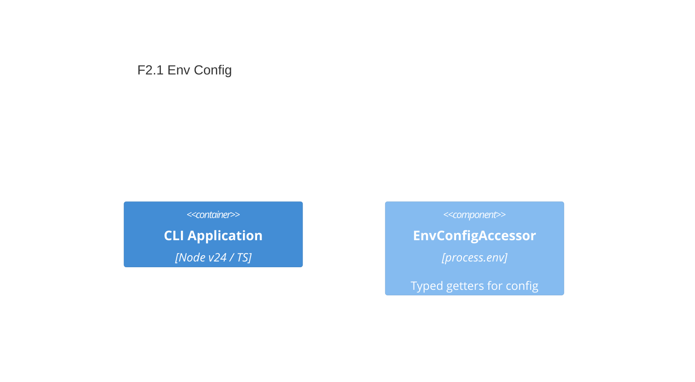

# F2.1 `--env-file` wiring and config access Design 

## Overview

Wire Node’s built-in `--env-file` usage into the developer workflow and provide a small, typed configuration accessor to retrieve environment variables with sensible defaults. Do not add `dotenv`. Prefer `--env-file-if-exists` for optional files.

## Data Models

### Config

- **Purpose:** Output; exposes environment-backed configuration values
- **Tier / Layer:** CLI Application / core

```ts
// Pseudo-type for reference
interface Config {
  getString(key: string, def?: string): string;
  getNumber(key: string, def?: number): number;
  getBoolean(key: string, def?: boolean): boolean;
}
```

## Components

### EnvConfigAccessor

- **Purpose:** Provide typed getters over `process.env` with defaulting and minimal coercion
- **Interfaces:**
  - getString(key: string, def?: string): string
  - getNumber(key: string, def?: number): number
  - getBoolean(key: string, def?: boolean): boolean
- **Dependencies:** Node `process.env`
- **Reuses:** None initially; may later reuse Zod for strict validation
  
```ts
// Public API sketch
export interface Config {
  getString(key: string, def?: string): string;
  getNumber(key: string, def?: number): number;
  getBoolean(key: string, def?: boolean): boolean;
}

export function getConfig(): Config {
  // return accessors over process.env
}
```

## User interface

No new command; document usage via README and ensure CLI can be launched with:
- `node --env-file=.env ./dist/bin/archetype-node.js`
- `node --env-file-if-exists=.env.local ./dist/bin/archetype-node.js`

## Aspects

### Monitoring

- None. Accessor is pure and side-effect free.

### Security

- Never commit secrets. `.env` stays local. Precedence: real env overrides files.

### Error Handling

- Getters must not throw for absent keys if a default is provided. Without default, throwing or returning empty string is allowed based on call site choice; prefer explicit default usage.

## Architecture

- Single-container CLI. Place accessor in `src/core/config` for reuse across commands.

### Component Diagram



### File Structure

```plaintext
src/
  core/
    config/
      env-config.ts  # getConfig() with typed getters
```

> End of Feature Design for F2.1, last updated 2025-08-19.
