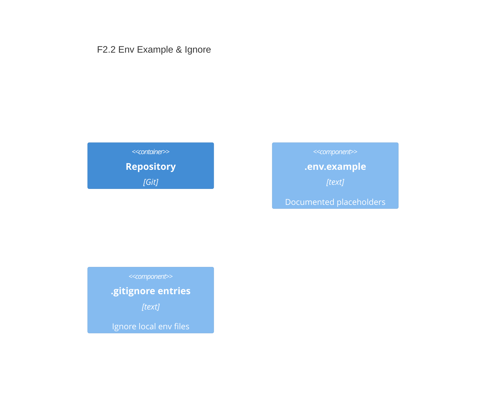

# F2.2 Provide `.env.example` and ignore `.env` Design 

## Overview

Add a repository-tracked `.env.example` with safe placeholders and comments, and update `.gitignore` to exclude real `.env` files and typical variants. This complements F2.1 by making local configuration discoverable and safe.

## Data Models

No runtime models; this feature affects repository artifacts and developer workflow.

## Components

### RepoArtifacts: EnvTemplates

- **Purpose:** Provide a canonical example for environment variables.
- **Interfaces:** N/A (documentation artifact)
- **Dependencies:** Node `--env-file` behavior (syntax compatibility)
- **Reuses:** Conventions from F2.1
  
```dotenv
# Example environment variables for Archetype Node CLI
# Copy this file to `.env` or `.env.local` and adjust values.
# Syntax compatible with Node's --env-file: KEY=VALUE and # comments.

# Output verbosity (true|false)
AID_CLI_DEBUG=false

# Preferred units for weather command (metric|imperial)
AID_WEATHER_UNITS=metric

# Optional: custom API base URLs for development/testing
AID_IP_API_BASE=https://ip-api.com
AID_OPEN_METEO_BASE=https://api.open-meteo.com
```

### RepoConfig: GitIgnoreRules

- **Purpose:** Prevent committing secrets or local overrides.
- **Interfaces:** `.gitignore` entries
- **Dependencies:** Git
- **Reuses:** Common Node/CLI ignore patterns
  
```gitignore
# Local environment files
.env
.env.*
.env.local
.env.*.local
```

## User interface

- Developers will copy `.env.example` to `.env` and run with Node's flags from F2.1, e.g. `--env-file=.env` or `--env-file-if-exists=.env.local`.

## Aspects

### Monitoring

- Not applicable.

### Security

- Ensure `.env` variants are ignored. Do not include secrets in the example file.

### Error Handling

- Not applicable at runtime. Misconfiguration is discoverable via CLI behavior; F2.1 accessors may supply defaults.

## Architecture

- Single-container CLI repository. This feature is purely repo hygiene supporting configuration.

### Component Diagram



### File Structure

```plaintext
.env.example           # example variables (tracked)
.gitignore             # includes rules to ignore .env variants
```

> End of Feature Design for F2.2, last updated 2025-08-20.
